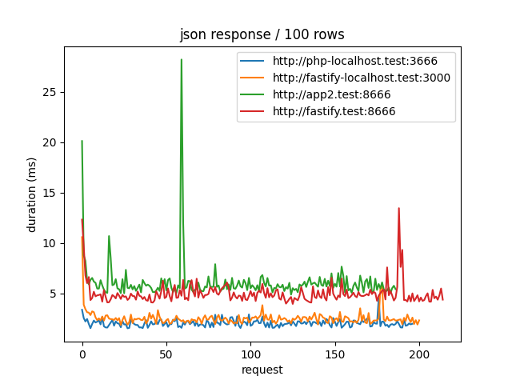
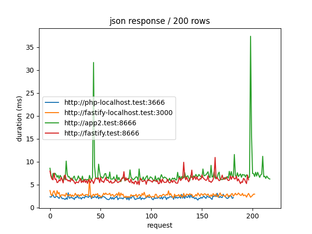
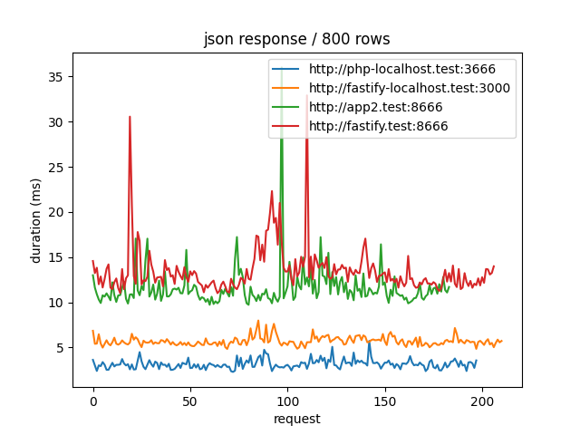
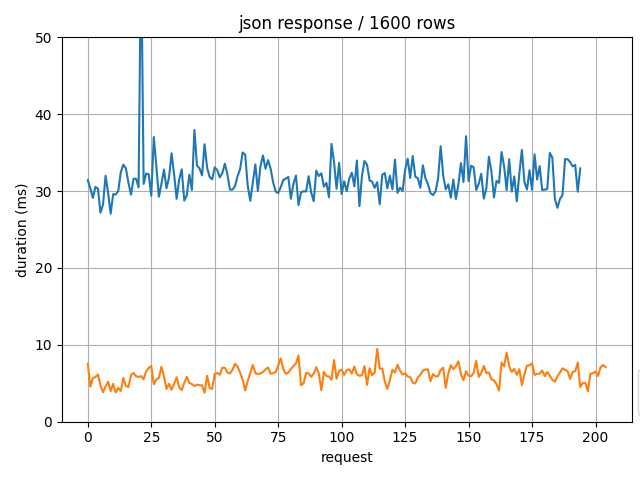
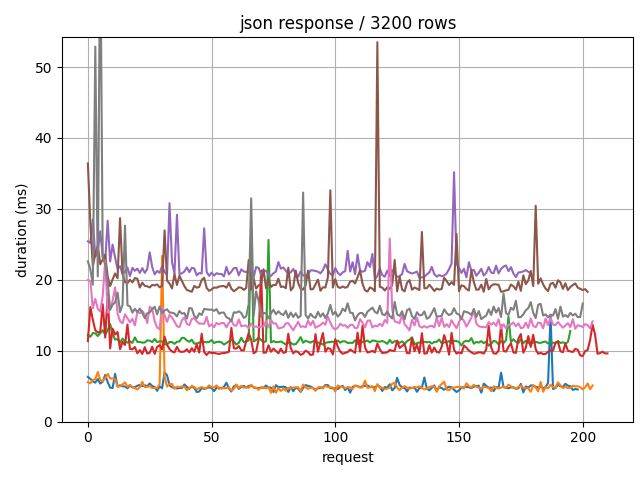

# PHP vs Node Fastify

## SQLITE

* SQLite DB has a table with about 60.000 rows

### Setup 

4 differents setups on the same SQLite DB

* Node Fastify with fastify-sqlite, 
  * http://fastify-localhost:3000

* PHP with PDO
  * http://php-localhost:3666
  * with PHP built-in server 

* Node Fastify with fastify-sqlite, 
  * http://fastify.test:8666
  * inside Docker containers
  * with Nginx and Reverse Proxy 

* PHP with PDO
  * http://app2:test:8666
  * inside Docker containers
  * with Nginx and PHP-FPM 


### Commands


* localhost PHP
* https://www.php.net/manual/en/features.commandline.webserver.php

```
php -S php-localhost.test:3666 -t public/

```
* Apache Bench

```
ab -n 1000 -c 10 http://php-localhost.test:3666/
```

```
This is ApacheBench, Version 2.3 <$Revision: 1903618 $>
Copyright 1996 Adam Twiss, Zeus Technology Ltd, http://www.zeustech.net/
Licensed to The Apache Software Foundation, http://www.apache.org/

Benchmarking php-localhost.test (be patient)
Completed 100 requests
Completed 200 requests
Completed 300 requests
Completed 400 requests
Completed 500 requests
Completed 600 requests
Completed 700 requests
Completed 800 requests
Completed 900 requests
Completed 1000 requests
Finished 1000 requests


Server Software:        
Server Hostname:        php-localhost.test
Server Port:            3666

Document Path:          /
Document Length:        246872 bytes

Concurrency Level:      10
Time taken for tests:   1.190 seconds
Complete requests:      1000
Failed requests:        116
   (Connect: 0, Receive: 0, Length: 116, Exceptions: 0)
Total transferred:      247035285 bytes
HTML transferred:       246872285 bytes
Requests per second:    840.29 [#/sec] (mean)
Time per request:       11.901 [ms] (mean)
Time per request:       1.190 [ms] (mean, across all concurrent requests)
Transfer rate:          202715.30 [Kbytes/sec] received

Connection Times (ms)
              min  mean[+/-sd] median   max
Connect:        0    0   0.0      0       0
Processing:     2   12   1.3     11      20
Waiting:        2   11   1.2     11      19
Total:          3   12   1.3     12      20

Percentage of the requests served within a certain time (ms)
  50%     12
  66%     12
  75%     12
  80%     12
  90%     12
  95%     14
  98%     17
  99%     18
 100%     20 (longest request)
```

* localhost Node Fastify

```
npm run dev

npm start

```

* Docker

```
docker-compose build
docker-compose up -d
```

### Performances 

About 10-15 ms per query to read 1000 rows
* with ORDER BY id DESC
* table about 60.000 rows

### Comparison between Fastify and PHP

#### 100 rows



#### 200 ROWS



#### 400 ROWS


#### 800 ROWS



#### 1600 ROWS



#### 3200 ROWS



## Docker x Php Conflict

* if there's a Php loop and inside there's an include to a file which is mounted, then the execution time is very slow 😱
* Hack: copy the file to include in the container local filesystem
  * the Php function tmpnam() can be used to create a temporary file
  * https://www.php.net/manual/fr/function.tempnam.php
  * 🔥 Only Php can move code dynamically so easily 😎
  * Performances are then acceptable, but still slow 😅
  * So best workaround is to avoid to include files in a loop ?! 😅 

