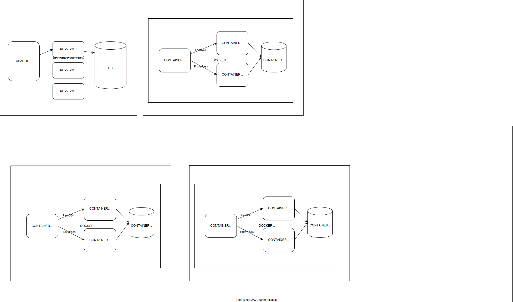

# Docs

## Docker




## Content

### HTML page

* Structure in tree of titles
* Semantic HTML
  * h1, h2, h3, h4, h5, h6
* content
  * 1.000 words 
  * possible structure:
  * 1 h1 x 5 h2 x 4 h3 x 50 words
  * main
    * 1 h1
      * 5 h2
        * 4 h3
          * 50 words

* Paragraph with about 50 words

```
Search Engine Optimization (SEO) is the practice of optimizing a website to rank higher in search engine results pages (SERPs). This is achieved through various techniques such as keyword research, on-page optimization, link building, and content creation. SEO is important for businesses to increase their online visibility and attract more organic traffic to their website.
```

* for the same content, french takes more words than english 😅

```
L'optimisation pour les moteurs de recherche (SEO) est la pratique d'optimiser un site web pour qu'il se classe plus haut dans les pages de résultats des moteurs de recherche (SERP). Cela est réalisé grâce à diverses techniques telles que la recherche de mots clés, l'optimisation sur la page, la création de liens et de contenu. Le SEO est important pour les entreprises afin d'augmenter leur visibilité en ligne et d'attirer plus de trafic organique sur leur site web.
```

#### Responsive Design

A strong constraint on coding a HTML page is to make it responsive.
Most visitors are using a mobile phone to visit a website.
* Mobile screens
  * Mobile Small = 320x640 pixels
  * iOS tablets = 768x1024 pixels
* Portrait or landscape usage
  
And large screens are also used, HD, full HD, 4K, 8K, ...
* HD = 1280 x 720 pixels
* Full HD = 1920 x 1080 pixels
* 4K = 3840 x 2160 pixels
* 8K = 7680 x 4320 pixels

But the content is the same for all devices.
* Mobile first
  * 320px

### SEO constraints conflicting

* More content in the page is better for SEO
  * keywords density
* But more content is not good for mobile users
  * they have to scroll a lot
  * they have to wait for the page to load
  * they have to read a lot
  * they have to click a lot
  * they have to zoom in and out
  * ...
* UX: User Experience
* Google Core Web vitals
  * https://web.dev/vitals/

### CMS: Content Management System

* SQL Database to store contents
* Better performances if 20- SQL requests to build a HTML page dynamically
* Budget less than 100ms to build a HTML page
  * From the visitor perspective, most time is spent on internet transport layer
    * HTML page with +1.000 words about 10 Ko (compressed / gzip)
      * if network debit speed: around 1 Mbits/s = 1 Kbits/ms
      * about 100ms to download the HTML page
      * mobile 4G: around 100 Mbits/s = 100 Kbits/ms
      * about 10ms to download the HTML page
    * Thanks to Video streaming popularity
      * https://support.google.com/youtube/answer/2853702
      * Full HD video (1920x1080 x 30 fps)
        * 3 Mbits /s = 3 Kbits/ms
    * datacenter / CDN
    * web server compression 
      * (deflate / gzip)
      * caches
  * dev tools: chrome > network > waterfall

* UX: User Experience
  * Humans
  * 1s is acceptable
  * 100ms is fast
  * 60 FPS = 16ms is ideal
  * 30 FPS = 33ms is fluid
* Above The Fold
  * A visitor is passive and waits for the page to load
  * The visitor is not scrolling
  * The visitor is not clicking
  * Frustration is growing as the visitor is waiting
  * Solution: show a teaser quickly
    * a title
    * a text
    * a picture
    * a button
    * ...
  * Keep the visitor busy while the page is loading


## Generative AI for content

* Example with Github Copilot

```
Web Core Vitals are a set of metrics that Google uses to measure the user experience of a website. These metrics are designed to help website owners and developers understand how their website performs in terms of speed, responsiveness, and visual stability. The three core metrics that make up Web Core Vitals are Largest Contentful Paint (LCP), First Input Delay (FID), and Cumulative Layout Shift (CLS).

Largest Contentful Paint (LCP) measures the loading performance of a website. It measures the time it takes for the largest content element on a page to load. This could be an image, a video, or a block of text. A good LCP score is less than 2.5 seconds.

First Input Delay (FID) measures the interactivity of a website. It measures the time it takes for a user to interact with a website after clicking on a link or button. A good FID score is less than 100 milliseconds.

Cumulative Layout Shift (CLS) measures the visual stability of a website. It measures the amount of unexpected layout shifts that occur during the loading of a website. A good CLS score is less than 0.1.

Google has announced that Web Core Vitals will become a ranking factor in May 2021. This means that websites that perform well on these metrics will be given a boost in search engine rankings. It is important for website owners and developers to optimize their website for Web Core Vitals to ensure that their website is user-friendly and ranks well in search engine results pages.
```

* automatic translation in french

```
Les Web Core Vitals sont un ensemble de métriques que Google utilise pour mesurer l'expérience utilisateur d'un site web. Ces métriques sont conçues pour aider les propriétaires de sites web et les développeurs à comprendre comment leur site web se comporte en termes de vitesse, de réactivité et de stabilité visuelle. Les trois métriques principales qui composent les Web Core Vitals sont Largest Contentful Paint (LCP), First Input Delay (FID) et Cumulative Layout Shift (CLS).

Largest Contentful Paint (LCP) mesure les performances de chargement d'un site web. Il mesure le temps nécessaire pour charger l'élément de contenu le plus important d'une page. Il peut s'agir d'une image, d'une vidéo ou d'un bloc de texte. Un bon score LCP est inférieur à 2,5 secondes.

First Input Delay (FID) mesure l'interactivité d'un site web. Il mesure le temps nécessaire à un utilisateur pour interagir avec un site web après avoir cliqué sur un lien ou un bouton. Un bon score FID est inférieur à 100 millisecondes.

Cumulative Layout Shift (CLS) mesure la stabilité visuelle d'un site web. Il mesure la quantité de changements de mise en page inattendus qui se produisent pendant le chargement d'un site web. Un bon score CLS est inférieur à 0,1.

Google a annoncé que les Web Core Vitals deviendront un facteur de classement en mai 2021. Cela signifie que les sites web qui performant bien sur ces métriques bénéficieront d'un coup de pouce dans les résultats de recherche. Il est important pour les propriétaires de sites web et les développeurs d'optimiser leur site web pour les Web Core Vitals afin de s'assurer que leur site web est convivial pour les utilisateurs et qu'il se classe bien dans les résultats de recherche.
```

## Intelligence

* Intelligence is the capacity for a living organism to move in SpaceTime
* (4D = 3D space x time)

Notes:
* environment is fundamental
