# Benchmark

## PHP + MySQL

* Performances are degrading when the number of SQL requests increases for only one page
* 10-20  SQL requests per page is a good number
  * Docker+Nginx+Php+MariaDB is rather stable
  * (typically going from 10ms to 20ms per page as rows are from 100 to 3200)
* 30+ SQL requests per page can be a problem
  * Docker mariadb is rather stable (in slowing down regularly)
  * local MySQL is not stable and loosing performance rapidly if data volume is also important ?! 
    * FIXME: improve local MySQL settings ?

## CHARTS

### 100 rows

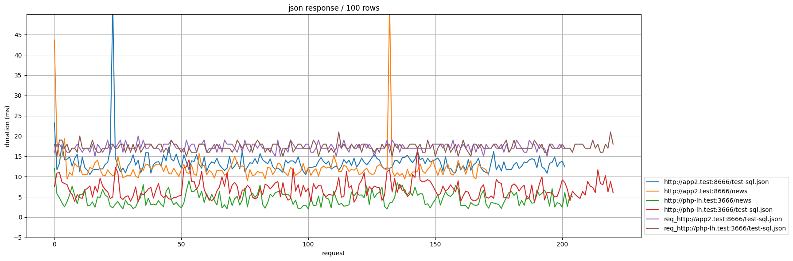

### 200 rows

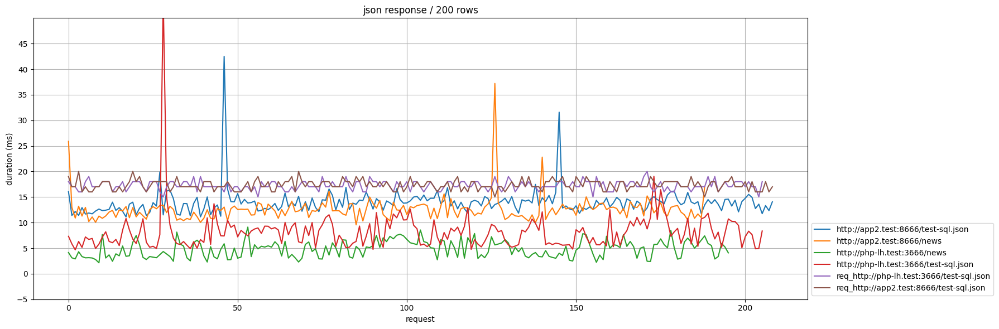 

### 400 rows

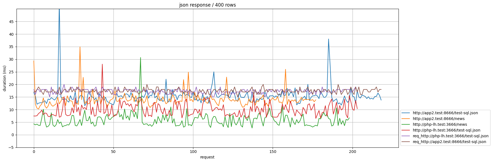 

### 800 rows

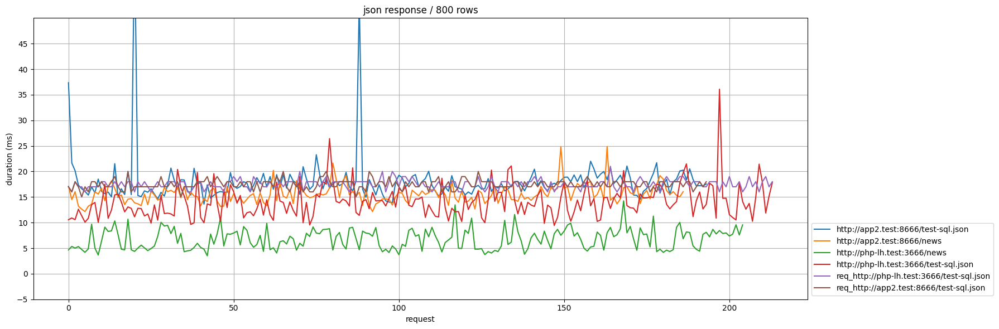 

* note: local MySQL is not stable and loosing performance rapidly if data volume is also important ?!
* Docker mariadb is rather stable (in slowing down regularly)

### 1600 rows

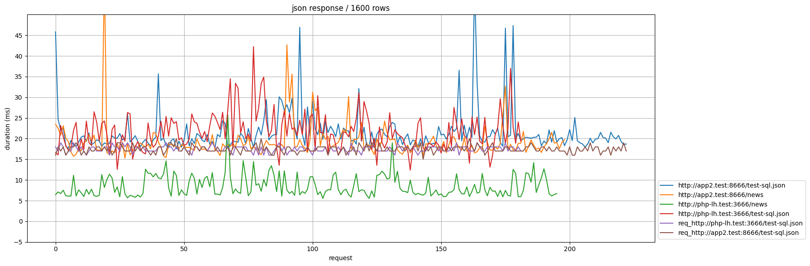 

* Note: local MySQL is not stable and loosing performance rapidly if data volume is also important ?!

### 3200 rows

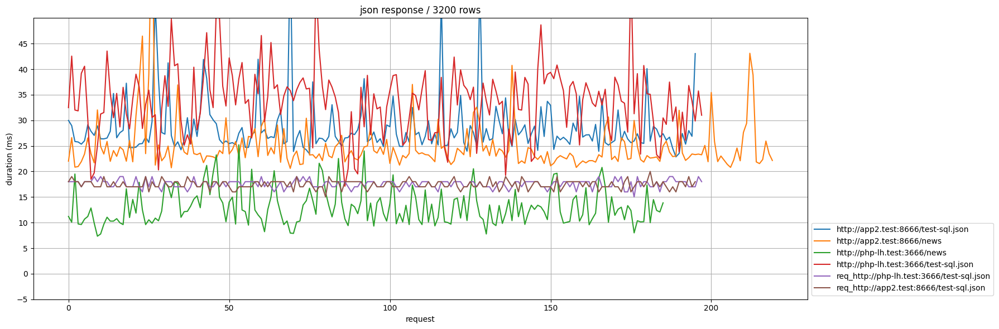

* Note: local MySQL is not stable and loosing performance rapidly if data volume is also important ?!

## CHARTS / SQLITE

* With SQLite, PHP is always better than Fastify
  * localhost
  * Docker
    * DDev is about the same as localhost + Fastify (surprising...😱😎)
    * (DDev is containers Nginx + PHP)
    * TODO: check DDev + Fastify ?

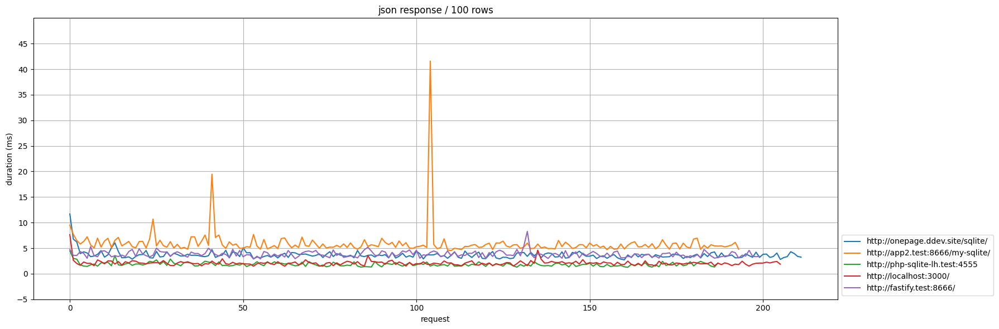 
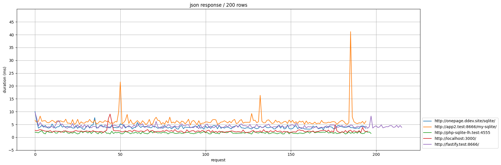 
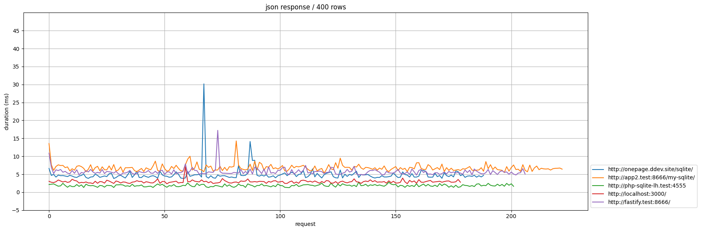 
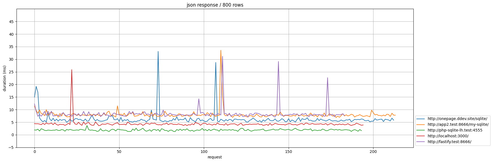 
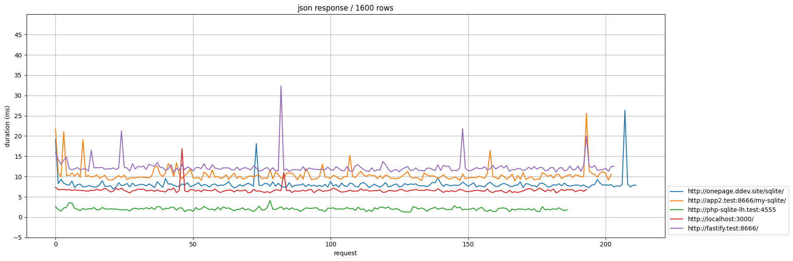 
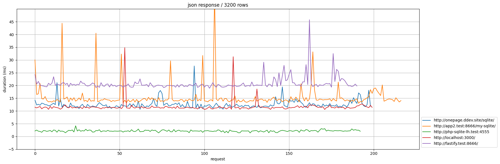