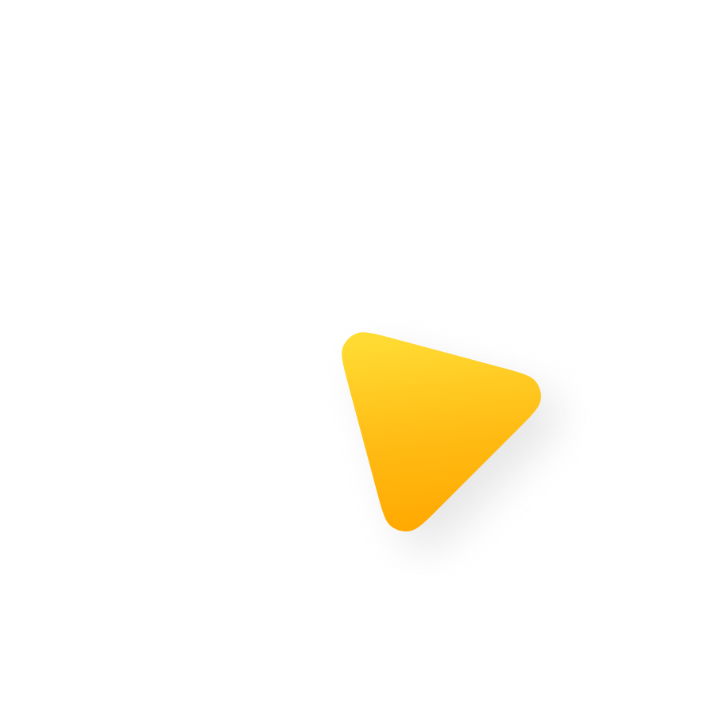

# MOVIE

---

## frame 2

This video is generated from a slidev presentation.

This sounds crazy but it's true.

😱 😎 🔥 🚀 ⭐️ 🎁 👍

---

## frame 3

This video is generated from a slidev presentation.

This sounds crazy but it's true.

😱 😎 🔥 🚀 ⭐️ 🎁 👍

---

## frame 4

This video is generated from a slidev presentation.

This sounds crazy but it's true.

😱 😎 🔥 🚀 ⭐️ 🎁 👍

---

## frame 5

This video is generated from a slidev presentation.

This sounds crazy but it's true.

😱 😎 🔥 🚀 ⭐️ 🎁 👍

---

## frame 6

This video is generated from a slidev presentation.

This sounds crazy but it's true.

😱 😎 🔥 🚀 ⭐️ 🎁 👍

---

## frame 7

This video is generated from a slidev presentation.

This sounds crazy but it's true.

😱 😎 🔥 🚀 ⭐️ 🎁 👍

---

## frame 8

This video is generated from a slidev presentation.

This sounds crazy but it's true.

😱 😎 🔥 🚀 ⭐️ 🎁 👍

---

## frame 9

This video is generated from a slidev presentation.

This sounds crazy but it's true.

😱 😎 🔥 🚀 ⭐️ 🎁 👍

---

## frame 10

This video is generated from a slidev presentation.

This sounds crazy but it's true.

😱 😎 🔥 🚀 ⭐️ 🎁 👍

---

## frame 11

This video is generated from a slidev presentation.

This sounds crazy but it's true.

😱 😎 🔥 🚀 ⭐️ 🎁 👍

---

## frame 12

This video is generated from a slidev presentation.

This sounds crazy but it's true.

😱 😎 🔥 🚀 ⭐️ 🎁 👍

---

## frame 13

This video is generated from a slidev presentation.

This sounds crazy but it's true.

😱 😎 🔥 🚀 ⭐️ 🎁 👍

---

## frame 14

This video is generated from a slidev presentation.

This sounds crazy but it's true.

😱 😎 🔥 🚀 ⭐️ 🎁 👍

---

## frame 15

This video is generated from a slidev presentation.

This sounds crazy but it's true.

😱 😎 🔥 🚀 ⭐️ 🎁 👍

---

## frame 16

This video is generated from a slidev presentation.

This sounds crazy but it's true.

😱 😎 🔥 🚀 ⭐️ 🎁 👍

---

## frame 17

This video is generated from a slidev presentation.

This sounds crazy but it's true.

😱 😎 🔥 🚀 ⭐️ 🎁 👍

---

## frame 18

This video is generated from a slidev presentation.

This sounds crazy but it's true.

😱 😎 🔥 🚀 ⭐️ 🎁 👍

---

## frame 19

This video is generated from a slidev presentation.

This sounds crazy but it's true.

😱 😎 🔥 🚀 ⭐️ 🎁 👍

---

## frame 20

This video is generated from a slidev presentation.

This sounds crazy but it's true.

😱 😎 🔥 🚀 ⭐️ 🎁 👍

---

## frame 21

This video is generated from a slidev presentation.

This sounds crazy but it's true.

😱 😎 🔥 🚀 ⭐️ 🎁 👍

---

## frame 22

This video is generated from a slidev presentation.

This sounds crazy but it's true.

😱 😎 🔥 🚀 ⭐️ 🎁 👍

---

## frame 23

This video is generated from a slidev presentation.

This sounds crazy but it's true.

😱 😎 🔥 🚀 ⭐️ 🎁 👍

---

## frame 24

This video is generated from a slidev presentation.

This sounds crazy but it's true.

😱 😎 🔥 🚀 ⭐️ 🎁 👍

---

## frame 25

This video is generated from a slidev presentation.

This sounds crazy but it's true.

😱 😎 🔥 🚀 ⭐️ 🎁 👍

---

## frame 26

This video is generated from a slidev presentation.

This sounds crazy but it's true.

😱 😎 🔥 🚀 ⭐️ 🎁 👍

---

## frame 27

This video is generated from a slidev presentation.

This sounds crazy but it's true.

😱 😎 🔥 🚀 ⭐️ 🎁 👍

---

## frame 28

This video is generated from a slidev presentation.

This sounds crazy but it's true.

😱 😎 🔥 🚀 ⭐️ 🎁 👍

---

## frame 29

This video is generated from a slidev presentation.

This sounds crazy but it's true.

😱 😎 🔥 🚀 ⭐️ 🎁 👍

---

## frame 30

This video is generated from a slidev presentation.

This sounds crazy but it's true.

😱 😎 🔥 🚀 ⭐️ 🎁 👍

---

## frame 31

This video is generated from a slidev presentation.

This sounds crazy but it's true.

😱 😎 🔥 🚀 ⭐️ 🎁 👍

---

## frame 32

This video is generated from a slidev presentation.

This sounds crazy but it's true.

😱 😎 🔥 🚀 ⭐️ 🎁 👍

---

## frame 33

This video is generated from a slidev presentation.

This sounds crazy but it's true.

😱 😎 🔥 🚀 ⭐️ 🎁 👍

---

## frame 34

This video is generated from a slidev presentation.

This sounds crazy but it's true.

😱 😎 🔥 🚀 ⭐️ 🎁 👍

---

## frame 35

This video is generated from a slidev presentation.

This sounds crazy but it's true.

😱 😎 🔥 🚀 ⭐️ 🎁 👍

---

## frame 36

This video is generated from a slidev presentation.

This sounds crazy but it's true.

😱 😎 🔥 🚀 ⭐️ 🎁 👍

---

## frame 37

This video is generated from a slidev presentation.

This sounds crazy but it's true.

😱 😎 🔥 🚀 ⭐️ 🎁 👍

---

## frame 38

This video is generated from a slidev presentation.

This sounds crazy but it's true.

😱 😎 🔥 🚀 ⭐️ 🎁 👍

---

## frame 39

This video is generated from a slidev presentation.

This sounds crazy but it's true.

😱 😎 🔥 🚀 ⭐️ 🎁 👍

---

## frame 40

This video is generated from a slidev presentation.

This sounds crazy but it's true.

😱 😎 🔥 🚀 ⭐️ 🎁 👍

---

## frame 41

This video is generated from a slidev presentation.

This sounds crazy but it's true.

😱 😎 🔥 🚀 ⭐️ 🎁 👍

---

## frame 42

This video is generated from a slidev presentation.

This sounds crazy but it's true.

😱 😎 🔥 🚀 ⭐️ 🎁 👍

---

## frame 43

This video is generated from a slidev presentation.

This sounds crazy but it's true.

😱 😎 🔥 🚀 ⭐️ 🎁 👍

---

## frame 44

This video is generated from a slidev presentation.

This sounds crazy but it's true.

😱 😎 🔥 🚀 ⭐️ 🎁 👍

---

## frame 45

This video is generated from a slidev presentation.

This sounds crazy but it's true.

😱 😎 🔥 🚀 ⭐️ 🎁 👍

---

## frame 46

This video is generated from a slidev presentation.

This sounds crazy but it's true.

😱 😎 🔥 🚀 ⭐️ 🎁 👍

---

## frame 47

This video is generated from a slidev presentation.

This sounds crazy but it's true.

😱 😎 🔥 🚀 ⭐️ 🎁 👍

---

## frame 48

This video is generated from a slidev presentation.

This sounds crazy but it's true.

😱 😎 🔥 🚀 ⭐️ 🎁 👍

---

## frame 49

This video is generated from a slidev presentation.

This sounds crazy but it's true.

😱 😎 🔥 🚀 ⭐️ 🎁 👍

---

## frame 50

This video is generated from a slidev presentation.

This sounds crazy but it's true.

😱 😎 🔥 🚀 ⭐️ 🎁 👍

---

## frame 51

This video is generated from a slidev presentation.

This sounds crazy but it's true.

😱 😎 🔥 🚀 ⭐️ 🎁 👍

---

## frame 52

This video is generated from a slidev presentation.

This sounds crazy but it's true.

😱 😎 🔥 🚀 ⭐️ 🎁 👍

---

## frame 53

This video is generated from a slidev presentation.

This sounds crazy but it's true.

😱 😎 🔥 🚀 ⭐️ 🎁 👍

---

## frame 54

This video is generated from a slidev presentation.

This sounds crazy but it's true.

😱 😎 🔥 🚀 ⭐️ 🎁 👍

---

## frame 55

This video is generated from a slidev presentation.

This sounds crazy but it's true.

😱 😎 🔥 🚀 ⭐️ 🎁 👍

---

## frame 56

This video is generated from a slidev presentation.

This sounds crazy but it's true.

😱 😎 🔥 🚀 ⭐️ 🎁 👍

---

## frame 57

This video is generated from a slidev presentation.

This sounds crazy but it's true.

😱 😎 🔥 🚀 ⭐️ 🎁 👍

---

## frame 58

This video is generated from a slidev presentation.

This sounds crazy but it's true.

😱 😎 🔥 🚀 ⭐️ 🎁 👍

---

## frame 59

This video is generated from a slidev presentation.

This sounds crazy but it's true.

😱 😎 🔥 🚀 ⭐️ 🎁 👍

---

## frame 60

This video is generated from a slidev presentation.

This sounds crazy but it's true.

😱 😎 🔥 🚀 ⭐️ 🎁 👍

---

## frame 61

This video is generated from a slidev presentation.

This sounds crazy but it's true.

😱 😎 🔥 🚀 ⭐️ 🎁 👍

---

## frame 62

This video is generated from a slidev presentation.

This sounds crazy but it's true.

😱 😎 🔥 🚀 ⭐️ 🎁 👍

---

## frame 63

This video is generated from a slidev presentation.

This sounds crazy but it's true.

😱 😎 🔥 🚀 ⭐️ 🎁 👍

---

## frame 64

This video is generated from a slidev presentation.

This sounds crazy but it's true.

😱 😎 🔥 🚀 ⭐️ 🎁 👍

---

## frame 65

This video is generated from a slidev presentation.

This sounds crazy but it's true.

😱 😎 🔥 🚀 ⭐️ 🎁 👍

---

## frame 66

This video is generated from a slidev presentation.

This sounds crazy but it's true.

😱 😎 🔥 🚀 ⭐️ 🎁 👍

---

## frame 67

This video is generated from a slidev presentation.

This sounds crazy but it's true.

😱 😎 🔥 🚀 ⭐️ 🎁 👍

---

## frame 68

This video is generated from a slidev presentation.

This sounds crazy but it's true.

😱 😎 🔥 🚀 ⭐️ 🎁 👍

---

## frame 69

This video is generated from a slidev presentation.

This sounds crazy but it's true.

😱 😎 🔥 🚀 ⭐️ 🎁 👍

---

## frame 70

This video is generated from a slidev presentation.

This sounds crazy but it's true.

😱 😎 🔥 🚀 ⭐️ 🎁 👍

---

## frame 71

This video is generated from a slidev presentation.

This sounds crazy but it's true.

😱 😎 🔥 🚀 ⭐️ 🎁 👍

---

## frame 72

This video is generated from a slidev presentation.

This sounds crazy but it's true.

😱 😎 🔥 🚀 ⭐️ 🎁 👍

---

## frame 73

This video is generated from a slidev presentation.

This sounds crazy but it's true.

😱 😎 🔥 🚀 ⭐️ 🎁 👍

---

## frame 74

This video is generated from a slidev presentation.

This sounds crazy but it's true.

😱 😎 🔥 🚀 ⭐️ 🎁 👍

---

## frame 75

This video is generated from a slidev presentation.

This sounds crazy but it's true.

😱 😎 🔥 🚀 ⭐️ 🎁 👍

---

## frame 76

This video is generated from a slidev presentation.

This sounds crazy but it's true.

😱 😎 🔥 🚀 ⭐️ 🎁 👍

---

## frame 77

This video is generated from a slidev presentation.

This sounds crazy but it's true.

😱 😎 🔥 🚀 ⭐️ 🎁 👍

---

## frame 78

This video is generated from a slidev presentation.

This sounds crazy but it's true.

😱 😎 🔥 🚀 ⭐️ 🎁 👍

---

## frame 79

This video is generated from a slidev presentation.

This sounds crazy but it's true.

😱 😎 🔥 🚀 ⭐️ 🎁 👍

---

## frame 80

This video is generated from a slidev presentation.

This sounds crazy but it's true.

😱 😎 🔥 🚀 ⭐️ 🎁 👍

---

## frame 81

This video is generated from a slidev presentation.

This sounds crazy but it's true.

😱 😎 🔥 🚀 ⭐️ 🎁 👍

---

## frame 82

This video is generated from a slidev presentation.

This sounds crazy but it's true.

😱 😎 🔥 🚀 ⭐️ 🎁 👍

---

## frame 83

This video is generated from a slidev presentation.

This sounds crazy but it's true.

😱 😎 🔥 🚀 ⭐️ 🎁 👍

---

## frame 84

This video is generated from a slidev presentation.

This sounds crazy but it's true.

😱 😎 🔥 🚀 ⭐️ 🎁 👍

---

## frame 85

This video is generated from a slidev presentation.

This sounds crazy but it's true.

😱 😎 🔥 🚀 ⭐️ 🎁 👍

---

## frame 86

This video is generated from a slidev presentation.

This sounds crazy but it's true.

😱 😎 🔥 🚀 ⭐️ 🎁 👍

---

## frame 87

This video is generated from a slidev presentation.

This sounds crazy but it's true.

😱 😎 🔥 🚀 ⭐️ 🎁 👍

---

## frame 88

This video is generated from a slidev presentation.

This sounds crazy but it's true.

😱 😎 🔥 🚀 ⭐️ 🎁 👍

---

## frame 89

This video is generated from a slidev presentation.

This sounds crazy but it's true.

😱 😎 🔥 🚀 ⭐️ 🎁 👍

---

## frame 90

This video is generated from a slidev presentation.

This sounds crazy but it's true.

😱 😎 🔥 🚀 ⭐️ 🎁 👍

---

## frame 91

This video is generated from a slidev presentation.

This sounds crazy but it's true.

😱 😎 🔥 🚀 ⭐️ 🎁 👍

---

## frame 92

This video is generated from a slidev presentation.

This sounds crazy but it's true.

😱 😎 🔥 🚀 ⭐️ 🎁 👍

---

## frame 93

This video is generated from a slidev presentation.

This sounds crazy but it's true.

😱 😎 🔥 🚀 ⭐️ 🎁 👍

---

## frame 94

This video is generated from a slidev presentation.

This sounds crazy but it's true.

😱 😎 🔥 🚀 ⭐️ 🎁 👍

---

## frame 95

This video is generated from a slidev presentation.

This sounds crazy but it's true.

😱 😎 🔥 🚀 ⭐️ 🎁 👍

---

## frame 96

This video is generated from a slidev presentation.

This sounds crazy but it's true.

😱 😎 🔥 🚀 ⭐️ 🎁 👍

---

## frame 97

This video is generated from a slidev presentation.

This sounds crazy but it's true.

😱 😎 🔥 🚀 ⭐️ 🎁 👍

---

## frame 98

This video is generated from a slidev presentation.

This sounds crazy but it's true.

😱 😎 🔥 🚀 ⭐️ 🎁 👍

---

## frame 99

This video is generated from a slidev presentation.

This sounds crazy but it's true.

😱 😎 🔥 🚀 ⭐️ 🎁 👍

---

## frame 100

This video is generated from a slidev presentation.

This sounds crazy but it's true.

😱 😎 🔥 🚀 ⭐️ 🎁 👍

---

## frame 101

This video is generated from a slidev presentation.

This sounds crazy but it's true.

😱 😎 🔥 🚀 ⭐️ 🎁 👍

---

## frame 102

This video is generated from a slidev presentation.

This sounds crazy but it's true.

😱 😎 🔥 🚀 ⭐️ 🎁 👍

---

## frame 103

This video is generated from a slidev presentation.

This sounds crazy but it's true.

😱 😎 🔥 🚀 ⭐️ 🎁 👍

---

## frame 104

This video is generated from a slidev presentation.

This sounds crazy but it's true.

😱 😎 🔥 🚀 ⭐️ 🎁 👍

---

## frame 105

This video is generated from a slidev presentation.

This sounds crazy but it's true.

😱 😎 🔥 🚀 ⭐️ 🎁 👍

---

## frame 106

This video is generated from a slidev presentation.

This sounds crazy but it's true.

😱 😎 🔥 🚀 ⭐️ 🎁 👍

---

## frame 107

This video is generated from a slidev presentation.

This sounds crazy but it's true.

😱 😎 🔥 🚀 ⭐️ 🎁 👍

---

## frame 108

This video is generated from a slidev presentation.

This sounds crazy but it's true.

😱 😎 🔥 🚀 ⭐️ 🎁 👍

---

## frame 109

This video is generated from a slidev presentation.

This sounds crazy but it's true.

😱 😎 🔥 🚀 ⭐️ 🎁 👍

---

## frame 110

This video is generated from a slidev presentation.

This sounds crazy but it's true.

😱 😎 🔥 🚀 ⭐️ 🎁 👍

---

## frame 111

This video is generated from a slidev presentation.

This sounds crazy but it's true.

😱 😎 🔥 🚀 ⭐️ 🎁 👍

---

## frame 112

This video is generated from a slidev presentation.

This sounds crazy but it's true.

😱 😎 🔥 🚀 ⭐️ 🎁 👍

---

## frame 113

This video is generated from a slidev presentation.

This sounds crazy but it's true.

😱 😎 🔥 🚀 ⭐️ 🎁 👍

---

## frame 114

This video is generated from a slidev presentation.

This sounds crazy but it's true.

😱 😎 🔥 🚀 ⭐️ 🎁 👍

---

## frame 115

This video is generated from a slidev presentation.

This sounds crazy but it's true.

😱 😎 🔥 🚀 ⭐️ 🎁 👍

---

## frame 116

This video is generated from a slidev presentation.

This sounds crazy but it's true.

😱 😎 🔥 🚀 ⭐️ 🎁 👍

---

## frame 117

This video is generated from a slidev presentation.

This sounds crazy but it's true.

😱 😎 🔥 🚀 ⭐️ 🎁 👍

---

## frame 118

This video is generated from a slidev presentation.

This sounds crazy but it's true.

😱 😎 🔥 🚀 ⭐️ 🎁 👍

---

## frame 119

This video is generated from a slidev presentation.

This sounds crazy but it's true.

😱 😎 🔥 🚀 ⭐️ 🎁 👍

---

## frame 120

This video is generated from a slidev presentation.

This sounds crazy but it's true.

😱 😎 🔥 🚀 ⭐️ 🎁 👍

---

## frame 121

This video is generated from a slidev presentation.

This sounds crazy but it's true.

😱 😎 🔥 🚀 ⭐️ 🎁 👍

---

## frame 122

This video is generated from a slidev presentation.

This sounds crazy but it's true.

😱 😎 🔥 🚀 ⭐️ 🎁 👍

---

## frame 123

This video is generated from a slidev presentation.

This sounds crazy but it's true.

😱 😎 🔥 🚀 ⭐️ 🎁 👍

---

## frame 124

This video is generated from a slidev presentation.

This sounds crazy but it's true.

😱 😎 🔥 🚀 ⭐️ 🎁 👍

---

## frame 125

This video is generated from a slidev presentation.

This sounds crazy but it's true.

😱 😎 🔥 🚀 ⭐️ 🎁 👍

---

## frame 126

This video is generated from a slidev presentation.

This sounds crazy but it's true.

😱 😎 🔥 🚀 ⭐️ 🎁 👍

---

## frame 127

This video is generated from a slidev presentation.

This sounds crazy but it's true.

😱 😎 🔥 🚀 ⭐️ 🎁 👍

---

## frame 128

This video is generated from a slidev presentation.

This sounds crazy but it's true.

😱 😎 🔥 🚀 ⭐️ 🎁 👍

---

## frame 129

This video is generated from a slidev presentation.

This sounds crazy but it's true.

😱 😎 🔥 🚀 ⭐️ 🎁 👍

---

## frame 130

This video is generated from a slidev presentation.

This sounds crazy but it's true.

😱 😎 🔥 🚀 ⭐️ 🎁 👍

---

## frame 131

This video is generated from a slidev presentation.

This sounds crazy but it's true.

😱 😎 🔥 🚀 ⭐️ 🎁 👍

---

## frame 132

This video is generated from a slidev presentation.

This sounds crazy but it's true.

😱 😎 🔥 🚀 ⭐️ 🎁 👍

---

## frame 133

This video is generated from a slidev presentation.

This sounds crazy but it's true.

😱 😎 🔥 🚀 ⭐️ 🎁 👍

---

## frame 134

This video is generated from a slidev presentation.

This sounds crazy but it's true.

😱 😎 🔥 🚀 ⭐️ 🎁 👍

---

## frame 135

This video is generated from a slidev presentation.

This sounds crazy but it's true.

😱 😎 🔥 🚀 ⭐️ 🎁 👍

---

## frame 136

This video is generated from a slidev presentation.

This sounds crazy but it's true.

😱 😎 🔥 🚀 ⭐️ 🎁 👍

---

## frame 137

This video is generated from a slidev presentation.

This sounds crazy but it's true.

😱 😎 🔥 🚀 ⭐️ 🎁 👍

---

## frame 138

This video is generated from a slidev presentation.

This sounds crazy but it's true.

😱 😎 🔥 🚀 ⭐️ 🎁 👍

---

## frame 139

This video is generated from a slidev presentation.

This sounds crazy but it's true.

😱 😎 🔥 🚀 ⭐️ 🎁 👍

---

## frame 140

This video is generated from a slidev presentation.

This sounds crazy but it's true.

😱 😎 🔥 🚀 ⭐️ 🎁 👍

---

## frame 141

This video is generated from a slidev presentation.

This sounds crazy but it's true.

😱 😎 🔥 🚀 ⭐️ 🎁 👍

---

## frame 142

This video is generated from a slidev presentation.

This sounds crazy but it's true.

😱 😎 🔥 🚀 ⭐️ 🎁 👍

---

## frame 143

This video is generated from a slidev presentation.

This sounds crazy but it's true.

😱 😎 🔥 🚀 ⭐️ 🎁 👍

---

## frame 144

This video is generated from a slidev presentation.

This sounds crazy but it's true.

😱 😎 🔥 🚀 ⭐️ 🎁 👍

---

## frame 145

This video is generated from a slidev presentation.

This sounds crazy but it's true.

😱 😎 🔥 🚀 ⭐️ 🎁 👍

---

## frame 146

This video is generated from a slidev presentation.

This sounds crazy but it's true.

😱 😎 🔥 🚀 ⭐️ 🎁 👍

---

## frame 147

This video is generated from a slidev presentation.

This sounds crazy but it's true.

😱 😎 🔥 🚀 ⭐️ 🎁 👍

---

## frame 148

This video is generated from a slidev presentation.

This sounds crazy but it's true.

😱 😎 🔥 🚀 ⭐️ 🎁 👍

---

## frame 149

This video is generated from a slidev presentation.

This sounds crazy but it's true.

😱 😎 🔥 🚀 ⭐️ 🎁 👍

---

## frame 150

This video is generated from a slidev presentation.

This sounds crazy but it's true.

😱 😎 🔥 🚀 ⭐️ 🎁 👍

---

## frame 151

This video is generated from a slidev presentation.

This sounds crazy but it's true.

😱 😎 🔥 🚀 ⭐️ 🎁 👍

---

## frame 152

This video is generated from a slidev presentation.

This sounds crazy but it's true.

😱 😎 🔥 🚀 ⭐️ 🎁 👍

---

## frame 153

This video is generated from a slidev presentation.

This sounds crazy but it's true.

😱 😎 🔥 🚀 ⭐️ 🎁 👍

---

## frame 154

This video is generated from a slidev presentation.

This sounds crazy but it's true.

😱 😎 🔥 🚀 ⭐️ 🎁 👍

---

## frame 155

This video is generated from a slidev presentation.

This sounds crazy but it's true.

😱 😎 🔥 🚀 ⭐️ 🎁 👍

---

## frame 156

This video is generated from a slidev presentation.

This sounds crazy but it's true.

😱 😎 🔥 🚀 ⭐️ 🎁 👍

---

## frame 157

This video is generated from a slidev presentation.

This sounds crazy but it's true.

😱 😎 🔥 🚀 ⭐️ 🎁 👍

---

## frame 158

This video is generated from a slidev presentation.

This sounds crazy but it's true.

😱 😎 🔥 🚀 ⭐️ 🎁 👍

---

## frame 159

This video is generated from a slidev presentation.

This sounds crazy but it's true.

😱 😎 🔥 🚀 ⭐️ 🎁 👍

---

## frame 160

This video is generated from a slidev presentation.

This sounds crazy but it's true.

😱 😎 🔥 🚀 ⭐️ 🎁 👍

---

## frame 161

This video is generated from a slidev presentation.

This sounds crazy but it's true.

😱 😎 🔥 🚀 ⭐️ 🎁 👍

---

## frame 162

This video is generated from a slidev presentation.

This sounds crazy but it's true.

😱 😎 🔥 🚀 ⭐️ 🎁 👍

---

## frame 163

This video is generated from a slidev presentation.

This sounds crazy but it's true.

😱 😎 🔥 🚀 ⭐️ 🎁 👍

---

## frame 164

This video is generated from a slidev presentation.

This sounds crazy but it's true.

😱 😎 🔥 🚀 ⭐️ 🎁 👍

---

## frame 165

This video is generated from a slidev presentation.

This sounds crazy but it's true.

😱 😎 🔥 🚀 ⭐️ 🎁 👍

---

## frame 166

This video is generated from a slidev presentation.

This sounds crazy but it's true.

😱 😎 🔥 🚀 ⭐️ 🎁 👍

---

## frame 167

This video is generated from a slidev presentation.

This sounds crazy but it's true.

😱 😎 🔥 🚀 ⭐️ 🎁 👍

---

## frame 168

This video is generated from a slidev presentation.

This sounds crazy but it's true.

😱 😎 🔥 🚀 ⭐️ 🎁 👍

---

## frame 169

This video is generated from a slidev presentation.

This sounds crazy but it's true.

😱 😎 🔥 🚀 ⭐️ 🎁 👍

---

## frame 170

This video is generated from a slidev presentation.

This sounds crazy but it's true.

😱 😎 🔥 🚀 ⭐️ 🎁 👍

---

## frame 171

This video is generated from a slidev presentation.

This sounds crazy but it's true.

😱 😎 🔥 🚀 ⭐️ 🎁 👍

---

## frame 172

This video is generated from a slidev presentation.

This sounds crazy but it's true.

😱 😎 🔥 🚀 ⭐️ 🎁 👍

---

## frame 173

This video is generated from a slidev presentation.

This sounds crazy but it's true.

😱 😎 🔥 🚀 ⭐️ 🎁 👍

---

## frame 174

This video is generated from a slidev presentation.

This sounds crazy but it's true.

😱 😎 🔥 🚀 ⭐️ 🎁 👍

---

## frame 175

This video is generated from a slidev presentation.

This sounds crazy but it's true.

😱 😎 🔥 🚀 ⭐️ 🎁 👍

---

## frame 176

This video is generated from a slidev presentation.

This sounds crazy but it's true.

😱 😎 🔥 🚀 ⭐️ 🎁 👍

---

## frame 177

This video is generated from a slidev presentation.

This sounds crazy but it's true.

😱 😎 🔥 🚀 ⭐️ 🎁 👍

---

## frame 178

This video is generated from a slidev presentation.

This sounds crazy but it's true.

😱 😎 🔥 🚀 ⭐️ 🎁 👍

---

## frame 179

This video is generated from a slidev presentation.

This sounds crazy but it's true.

😱 😎 🔥 🚀 ⭐️ 🎁 👍

---

## frame 180

This video is generated from a slidev presentation.

This sounds crazy but it's true.

😱 😎 🔥 🚀 ⭐️ 🎁 👍

---

## frame 181

This video is generated from a slidev presentation.

This sounds crazy but it's true.

😱 😎 🔥 🚀 ⭐️ 🎁 👍

---

## frame 182

This video is generated from a slidev presentation.

This sounds crazy but it's true.

😱 😎 🔥 🚀 ⭐️ 🎁 👍

---

## frame 183

This video is generated from a slidev presentation.

This sounds crazy but it's true.

😱 😎 🔥 🚀 ⭐️ 🎁 👍

---

## frame 184

This video is generated from a slidev presentation.

This sounds crazy but it's true.

😱 😎 🔥 🚀 ⭐️ 🎁 👍

---

## frame 185

This video is generated from a slidev presentation.

This sounds crazy but it's true.

😱 😎 🔥 🚀 ⭐️ 🎁 👍

---

## frame 186

This video is generated from a slidev presentation.

This sounds crazy but it's true.

😱 😎 🔥 🚀 ⭐️ 🎁 👍

---

## frame 187

This video is generated from a slidev presentation.

This sounds crazy but it's true.

😱 😎 🔥 🚀 ⭐️ 🎁 👍

---

## frame 188

This video is generated from a slidev presentation.

This sounds crazy but it's true.

😱 😎 🔥 🚀 ⭐️ 🎁 👍

---

## frame 189

This video is generated from a slidev presentation.

This sounds crazy but it's true.

😱 😎 🔥 🚀 ⭐️ 🎁 👍

---

## frame 190

This video is generated from a slidev presentation.

This sounds crazy but it's true.

😱 😎 🔥 🚀 ⭐️ 🎁 👍

---

## frame 191

This video is generated from a slidev presentation.

This sounds crazy but it's true.

😱 😎 🔥 🚀 ⭐️ 🎁 👍

---

## frame 192

This video is generated from a slidev presentation.

This sounds crazy but it's true.

😱 😎 🔥 🚀 ⭐️ 🎁 👍

---

## frame 193

This video is generated from a slidev presentation.

This sounds crazy but it's true.

😱 😎 🔥 🚀 ⭐️ 🎁 👍

---

## frame 194

This video is generated from a slidev presentation.

This sounds crazy but it's true.

😱 😎 🔥 🚀 ⭐️ 🎁 👍

---

## frame 195

This video is generated from a slidev presentation.

This sounds crazy but it's true.

😱 😎 🔥 🚀 ⭐️ 🎁 👍

---

## frame 196

This video is generated from a slidev presentation.

This sounds crazy but it's true.

😱 😎 🔥 🚀 ⭐️ 🎁 👍

---

## frame 197

This video is generated from a slidev presentation.

This sounds crazy but it's true.

😱 😎 🔥 🚀 ⭐️ 🎁 👍

---

## frame 198

This video is generated from a slidev presentation.

This sounds crazy but it's true.

😱 😎 🔥 🚀 ⭐️ 🎁 👍

---

## frame 199

This video is generated from a slidev presentation.

This sounds crazy but it's true.

😱 😎 🔥 🚀 ⭐️ 🎁 👍

---

## frame 200

This video is generated from a slidev presentation.

This sounds crazy but it's true.

😱 😎 🔥 🚀 ⭐️ 🎁 👍

---

## frame 201

This video is generated from a slidev presentation.

This sounds crazy but it's true.

😱 😎 🔥 🚀 ⭐️ 🎁 👍

---

## frame 202

This video is generated from a slidev presentation.

This sounds crazy but it's true.

😱 😎 🔥 🚀 ⭐️ 🎁 👍

---

## frame 203

This video is generated from a slidev presentation.

This sounds crazy but it's true.

😱 😎 🔥 🚀 ⭐️ 🎁 👍

---

## frame 204

This video is generated from a slidev presentation.

This sounds crazy but it's true.

😱 😎 🔥 🚀 ⭐️ 🎁 👍

---

## frame 205

This video is generated from a slidev presentation.

This sounds crazy but it's true.

😱 😎 🔥 🚀 ⭐️ 🎁 👍

---

## frame 206

This video is generated from a slidev presentation.

This sounds crazy but it's true.

😱 😎 🔥 🚀 ⭐️ 🎁 👍

---

## frame 207

This video is generated from a slidev presentation.

This sounds crazy but it's true.

😱 😎 🔥 🚀 ⭐️ 🎁 👍

---

## frame 208

This video is generated from a slidev presentation.

This sounds crazy but it's true.

😱 😎 🔥 🚀 ⭐️ 🎁 👍

---

## frame 209

This video is generated from a slidev presentation.

This sounds crazy but it's true.

😱 😎 🔥 🚀 ⭐️ 🎁 👍

---

## frame 210

This video is generated from a slidev presentation.

This sounds crazy but it's true.

😱 😎 🔥 🚀 ⭐️ 🎁 👍

---

## frame 211

This video is generated from a slidev presentation.

This sounds crazy but it's true.

😱 😎 🔥 🚀 ⭐️ 🎁 👍

---

## frame 212

This video is generated from a slidev presentation.

This sounds crazy but it's true.

😱 😎 🔥 🚀 ⭐️ 🎁 👍

---

## frame 213

This video is generated from a slidev presentation.

This sounds crazy but it's true.

😱 😎 🔥 🚀 ⭐️ 🎁 👍

---

## frame 214

This video is generated from a slidev presentation.

This sounds crazy but it's true.

😱 😎 🔥 🚀 ⭐️ 🎁 👍

---

## frame 215

This video is generated from a slidev presentation.

This sounds crazy but it's true.

😱 😎 🔥 🚀 ⭐️ 🎁 👍

---

## frame 216

This video is generated from a slidev presentation.

This sounds crazy but it's true.

😱 😎 🔥 🚀 ⭐️ 🎁 👍

---

## frame 217

This video is generated from a slidev presentation.

This sounds crazy but it's true.

😱 😎 🔥 🚀 ⭐️ 🎁 👍

---

## frame 218

This video is generated from a slidev presentation.

This sounds crazy but it's true.

😱 😎 🔥 🚀 ⭐️ 🎁 👍

---

## frame 219

This video is generated from a slidev presentation.

This sounds crazy but it's true.

😱 😎 🔥 🚀 ⭐️ 🎁 👍

---

## frame 220

This video is generated from a slidev presentation.

This sounds crazy but it's true.

😱 😎 🔥 🚀 ⭐️ 🎁 👍

---

## frame 221

This video is generated from a slidev presentation.

This sounds crazy but it's true.

😱 😎 🔥 🚀 ⭐️ 🎁 👍

---

## frame 222

This video is generated from a slidev presentation.

This sounds crazy but it's true.

😱 😎 🔥 🚀 ⭐️ 🎁 👍

---

## frame 223

This video is generated from a slidev presentation.

This sounds crazy but it's true.

😱 😎 🔥 🚀 ⭐️ 🎁 👍

---

## frame 224

This video is generated from a slidev presentation.

This sounds crazy but it's true.

😱 😎 🔥 🚀 ⭐️ 🎁 👍

---

## frame 225

This video is generated from a slidev presentation.

This sounds crazy but it's true.

😱 😎 🔥 🚀 ⭐️ 🎁 👍

---

## frame 226

This video is generated from a slidev presentation.

This sounds crazy but it's true.

😱 😎 🔥 🚀 ⭐️ 🎁 👍

---

## frame 227

This video is generated from a slidev presentation.

This sounds crazy but it's true.

😱 😎 🔥 🚀 ⭐️ 🎁 👍

---

## frame 228

This video is generated from a slidev presentation.

This sounds crazy but it's true.

😱 😎 🔥 🚀 ⭐️ 🎁 👍

---

## frame 229

This video is generated from a slidev presentation.

This sounds crazy but it's true.

😱 😎 🔥 🚀 ⭐️ 🎁 👍

---

## frame 230

This video is generated from a slidev presentation.

This sounds crazy but it's true.

😱 😎 🔥 🚀 ⭐️ 🎁 👍

---

## frame 231

This video is generated from a slidev presentation.

This sounds crazy but it's true.

😱 😎 🔥 🚀 ⭐️ 🎁 👍

---

## frame 232

This video is generated from a slidev presentation.

This sounds crazy but it's true.

😱 😎 🔥 🚀 ⭐️ 🎁 👍

---

## frame 233

This video is generated from a slidev presentation.

This sounds crazy but it's true.

😱 😎 🔥 🚀 ⭐️ 🎁 👍

---

## frame 234

This video is generated from a slidev presentation.

This sounds crazy but it's true.

😱 😎 🔥 🚀 ⭐️ 🎁 👍

---

## frame 235

This video is generated from a slidev presentation.

This sounds crazy but it's true.

😱 😎 🔥 🚀 ⭐️ 🎁 👍

---

## frame 236

This video is generated from a slidev presentation.

This sounds crazy but it's true.

😱 😎 🔥 🚀 ⭐️ 🎁 👍

---

## frame 237

This video is generated from a slidev presentation.

This sounds crazy but it's true.

😱 😎 🔥 🚀 ⭐️ 🎁 👍

---

## frame 238

This video is generated from a slidev presentation.

This sounds crazy but it's true.

😱 😎 🔥 🚀 ⭐️ 🎁 👍

---

## frame 239

This video is generated from a slidev presentation.

This sounds crazy but it's true.

😱 😎 🔥 🚀 ⭐️ 🎁 👍

---

## frame 240

This video is generated from a slidev presentation.

This sounds crazy but it's true.

😱 😎 🔥 🚀 ⭐️ 🎁 👍

---

## frame 241

This video is generated from a slidev presentation.

This sounds crazy but it's true.

😱 😎 🔥 🚀 ⭐️ 🎁 👍

---

## frame 242

This video is generated from a slidev presentation.

This sounds crazy but it's true.

😱 😎 🔥 🚀 ⭐️ 🎁 👍

---

## frame 243

This video is generated from a slidev presentation.

This sounds crazy but it's true.

😱 😎 🔥 🚀 ⭐️ 🎁 👍

---

## frame 244

This video is generated from a slidev presentation.

This sounds crazy but it's true.

😱 😎 🔥 🚀 ⭐️ 🎁 👍

---

## frame 245

This video is generated from a slidev presentation.

This sounds crazy but it's true.

😱 😎 🔥 🚀 ⭐️ 🎁 👍

---

## frame 246

This video is generated from a slidev presentation.

This sounds crazy but it's true.

😱 😎 🔥 🚀 ⭐️ 🎁 👍

---

## frame 247

This video is generated from a slidev presentation.

This sounds crazy but it's true.

😱 😎 🔥 🚀 ⭐️ 🎁 👍

---

## frame 248

This video is generated from a slidev presentation.

This sounds crazy but it's true.

😱 😎 🔥 🚀 ⭐️ 🎁 👍

---

## frame 249

This video is generated from a slidev presentation.

This sounds crazy but it's true.

😱 😎 🔥 🚀 ⭐️ 🎁 👍

---

## frame 250

This video is generated from a slidev presentation.

This sounds crazy but it's true.

😱 😎 🔥 🚀 ⭐️ 🎁 👍

---

## frame 251

This video is generated from a slidev presentation.

This sounds crazy but it's true.

😱 😎 🔥 🚀 ⭐️ 🎁 👍

---

## frame 252

This video is generated from a slidev presentation.

This sounds crazy but it's true.

😱 😎 🔥 🚀 ⭐️ 🎁 👍

---

## frame 253

This video is generated from a slidev presentation.

This sounds crazy but it's true.

😱 😎 🔥 🚀 ⭐️ 🎁 👍

---

## frame 254

This video is generated from a slidev presentation.

This sounds crazy but it's true.

😱 😎 🔥 🚀 ⭐️ 🎁 👍

---

## frame 255

This video is generated from a slidev presentation.

This sounds crazy but it's true.

😱 😎 🔥 🚀 ⭐️ 🎁 👍

---

## frame 256

This video is generated from a slidev presentation.

This sounds crazy but it's true.

😱 😎 🔥 🚀 ⭐️ 🎁 👍

---

## frame 257

This video is generated from a slidev presentation.

This sounds crazy but it's true.

😱 😎 🔥 🚀 ⭐️ 🎁 👍

---

## frame 258

This video is generated from a slidev presentation.

This sounds crazy but it's true.

😱 😎 🔥 🚀 ⭐️ 🎁 👍

---

## frame 259

This video is generated from a slidev presentation.

This sounds crazy but it's true.

😱 😎 🔥 🚀 ⭐️ 🎁 👍

---

## frame 260

This video is generated from a slidev presentation.

This sounds crazy but it's true.

😱 😎 🔥 🚀 ⭐️ 🎁 👍

---

## frame 261

This video is generated from a slidev presentation.

This sounds crazy but it's true.

😱 😎 🔥 🚀 ⭐️ 🎁 👍

---

## frame 262

This video is generated from a slidev presentation.

This sounds crazy but it's true.

😱 😎 🔥 🚀 ⭐️ 🎁 👍

---

## frame 263

This video is generated from a slidev presentation.

This sounds crazy but it's true.

😱 😎 🔥 🚀 ⭐️ 🎁 👍

---

## frame 264

This video is generated from a slidev presentation.

This sounds crazy but it's true.

😱 😎 🔥 🚀 ⭐️ 🎁 👍

---

## frame 265

This video is generated from a slidev presentation.

This sounds crazy but it's true.

😱 😎 🔥 🚀 ⭐️ 🎁 👍

---

## frame 266

This video is generated from a slidev presentation.

This sounds crazy but it's true.

😱 😎 🔥 🚀 ⭐️ 🎁 👍

---

## frame 267

This video is generated from a slidev presentation.

This sounds crazy but it's true.

😱 😎 🔥 🚀 ⭐️ 🎁 👍

---

## frame 268

This video is generated from a slidev presentation.

This sounds crazy but it's true.

😱 😎 🔥 🚀 ⭐️ 🎁 👍

---

## frame 269

This video is generated from a slidev presentation.

This sounds crazy but it's true.

😱 😎 🔥 🚀 ⭐️ 🎁 👍

---

## frame 270

This video is generated from a slidev presentation.

This sounds crazy but it's true.

😱 😎 🔥 🚀 ⭐️ 🎁 👍

---

## frame 271

This video is generated from a slidev presentation.

This sounds crazy but it's true.

😱 😎 🔥 🚀 ⭐️ 🎁 👍

---

## frame 272

This video is generated from a slidev presentation.

This sounds crazy but it's true.

😱 😎 🔥 🚀 ⭐️ 🎁 👍

---

## frame 273

This video is generated from a slidev presentation.

This sounds crazy but it's true.

😱 😎 🔥 🚀 ⭐️ 🎁 👍

---

## frame 274

This video is generated from a slidev presentation.

This sounds crazy but it's true.

😱 😎 🔥 🚀 ⭐️ 🎁 👍

---

## frame 275

This video is generated from a slidev presentation.

This sounds crazy but it's true.

😱 😎 🔥 🚀 ⭐️ 🎁 👍

---

## frame 276

This video is generated from a slidev presentation.

This sounds crazy but it's true.

😱 😎 🔥 🚀 ⭐️ 🎁 👍

---

## frame 277

This video is generated from a slidev presentation.

This sounds crazy but it's true.

😱 😎 🔥 🚀 ⭐️ 🎁 👍

---

## frame 278

This video is generated from a slidev presentation.

This sounds crazy but it's true.

😱 😎 🔥 🚀 ⭐️ 🎁 👍

---

## frame 279

This video is generated from a slidev presentation.

This sounds crazy but it's true.

😱 😎 🔥 🚀 ⭐️ 🎁 👍

---

## frame 280

This video is generated from a slidev presentation.

This sounds crazy but it's true.

😱 😎 🔥 🚀 ⭐️ 🎁 👍

---

## frame 281

This video is generated from a slidev presentation.

This sounds crazy but it's true.

😱 😎 🔥 🚀 ⭐️ 🎁 👍

---

## frame 282

This video is generated from a slidev presentation.

This sounds crazy but it's true.

😱 😎 🔥 🚀 ⭐️ 🎁 👍

---

## frame 283

This video is generated from a slidev presentation.

This sounds crazy but it's true.

😱 😎 🔥 🚀 ⭐️ 🎁 👍

---

## frame 284

This video is generated from a slidev presentation.

This sounds crazy but it's true.

😱 😎 🔥 🚀 ⭐️ 🎁 👍

---

## frame 285

This video is generated from a slidev presentation.

This sounds crazy but it's true.

😱 😎 🔥 🚀 ⭐️ 🎁 👍

---

## frame 286

This video is generated from a slidev presentation.

This sounds crazy but it's true.

😱 😎 🔥 🚀 ⭐️ 🎁 👍

---

## frame 287

This video is generated from a slidev presentation.

This sounds crazy but it's true.

😱 😎 🔥 🚀 ⭐️ 🎁 👍

---

## frame 288

This video is generated from a slidev presentation.

This sounds crazy but it's true.

😱 😎 🔥 🚀 ⭐️ 🎁 👍

---

## frame 289

This video is generated from a slidev presentation.

This sounds crazy but it's true.

😱 😎 🔥 🚀 ⭐️ 🎁 👍

---

## frame 290

This video is generated from a slidev presentation.

This sounds crazy but it's true.

😱 😎 🔥 🚀 ⭐️ 🎁 👍

---

## frame 291

This video is generated from a slidev presentation.

This sounds crazy but it's true.

😱 😎 🔥 🚀 ⭐️ 🎁 👍

---

## frame 292

This video is generated from a slidev presentation.

This sounds crazy but it's true.

😱 😎 🔥 🚀 ⭐️ 🎁 👍

---

## frame 293

This video is generated from a slidev presentation.

This sounds crazy but it's true.

😱 😎 🔥 🚀 ⭐️ 🎁 👍

---

## frame 294

This video is generated from a slidev presentation.

This sounds crazy but it's true.

😱 😎 🔥 🚀 ⭐️ 🎁 👍

---

## frame 295

This video is generated from a slidev presentation.

This sounds crazy but it's true.

😱 😎 🔥 🚀 ⭐️ 🎁 👍

---

## frame 296

This video is generated from a slidev presentation.

This sounds crazy but it's true.

😱 😎 🔥 🚀 ⭐️ 🎁 👍

---

## frame 297

This video is generated from a slidev presentation.

This sounds crazy but it's true.

😱 😎 🔥 🚀 ⭐️ 🎁 👍

---

## frame 298

This video is generated from a slidev presentation.

This sounds crazy but it's true.

😱 😎 🔥 🚀 ⭐️ 🎁 👍

---

## frame 299

This video is generated from a slidev presentation.

This sounds crazy but it's true.

😱 😎 🔥 🚀 ⭐️ 🎁 👍

---

## frame 300

This video is generated from a slidev presentation.

This sounds crazy but it's true.

😱 😎 🔥 🚀 ⭐️ 🎁 👍

---

## frame 301

This video is generated from a slidev presentation.

This sounds crazy but it's true.

😱 😎 🔥 🚀 ⭐️ 🎁 👍

---

## frame 302

This video is generated from a slidev presentation.

This sounds crazy but it's true.

😱 😎 🔥 🚀 ⭐️ 🎁 👍

---

## frame 303

This video is generated from a slidev presentation.

This sounds crazy but it's true.

😱 😎 🔥 🚀 ⭐️ 🎁 👍

---

## frame 304

This video is generated from a slidev presentation.

This sounds crazy but it's true.

😱 😎 🔥 🚀 ⭐️ 🎁 👍

---

## frame 305

This video is generated from a slidev presentation.

This sounds crazy but it's true.

😱 😎 🔥 🚀 ⭐️ 🎁 👍

---

## frame 306

This video is generated from a slidev presentation.

This sounds crazy but it's true.

😱 😎 🔥 🚀 ⭐️ 🎁 👍

---

## frame 307

This video is generated from a slidev presentation.

This sounds crazy but it's true.

😱 😎 🔥 🚀 ⭐️ 🎁 👍

---

## frame 308

This video is generated from a slidev presentation.

This sounds crazy but it's true.

😱 😎 🔥 🚀 ⭐️ 🎁 👍

---

## frame 309

This video is generated from a slidev presentation.

This sounds crazy but it's true.

😱 😎 🔥 🚀 ⭐️ 🎁 👍

---

## frame 310

This video is generated from a slidev presentation.

This sounds crazy but it's true.

😱 😎 🔥 🚀 ⭐️ 🎁 👍

---

## frame 311

This video is generated from a slidev presentation.

This sounds crazy but it's true.

😱 😎 🔥 🚀 ⭐️ 🎁 👍

---

## frame 312

This video is generated from a slidev presentation.

This sounds crazy but it's true.

😱 😎 🔥 🚀 ⭐️ 🎁 👍

---

## frame 313

This video is generated from a slidev presentation.

This sounds crazy but it's true.

😱 😎 🔥 🚀 ⭐️ 🎁 👍

---

## frame 314

This video is generated from a slidev presentation.

This sounds crazy but it's true.

😱 😎 🔥 🚀 ⭐️ 🎁 👍

---

## frame 315

This video is generated from a slidev presentation.

This sounds crazy but it's true.

😱 😎 🔥 🚀 ⭐️ 🎁 👍

---

## frame 316

This video is generated from a slidev presentation.

This sounds crazy but it's true.

😱 😎 🔥 🚀 ⭐️ 🎁 👍

---

## frame 317

This video is generated from a slidev presentation.

This sounds crazy but it's true.

😱 😎 🔥 🚀 ⭐️ 🎁 👍

---

## frame 318

This video is generated from a slidev presentation.

This sounds crazy but it's true.

😱 😎 🔥 🚀 ⭐️ 🎁 👍

---

## frame 319

This video is generated from a slidev presentation.

This sounds crazy but it's true.

😱 😎 🔥 🚀 ⭐️ 🎁 👍

---

## frame 320

This video is generated from a slidev presentation.

This sounds crazy but it's true.

😱 😎 🔥 🚀 ⭐️ 🎁 👍

---

## frame 321

This video is generated from a slidev presentation.

This sounds crazy but it's true.

😱 😎 🔥 🚀 ⭐️ 🎁 👍

---

## frame 322

This video is generated from a slidev presentation.

This sounds crazy but it's true.

😱 😎 🔥 🚀 ⭐️ 🎁 👍

---

## frame 323

This video is generated from a slidev presentation.

This sounds crazy but it's true.

😱 😎 🔥 🚀 ⭐️ 🎁 👍

---

## frame 324

This video is generated from a slidev presentation.

This sounds crazy but it's true.

😱 😎 🔥 🚀 ⭐️ 🎁 👍

---

## frame 325

This video is generated from a slidev presentation.

This sounds crazy but it's true.

😱 😎 🔥 🚀 ⭐️ 🎁 👍

---

## frame 326

This video is generated from a slidev presentation.

This sounds crazy but it's true.

😱 😎 🔥 🚀 ⭐️ 🎁 👍

---

## frame 327

This video is generated from a slidev presentation.

This sounds crazy but it's true.

😱 😎 🔥 🚀 ⭐️ 🎁 👍

---

## frame 328

This video is generated from a slidev presentation.

This sounds crazy but it's true.

😱 😎 🔥 🚀 ⭐️ 🎁 👍

---

## frame 329

This video is generated from a slidev presentation.

This sounds crazy but it's true.

😱 😎 🔥 🚀 ⭐️ 🎁 👍

---

## frame 330

This video is generated from a slidev presentation.

This sounds crazy but it's true.

😱 😎 🔥 🚀 ⭐️ 🎁 👍

---

## frame 331

This video is generated from a slidev presentation.

This sounds crazy but it's true.

😱 😎 🔥 🚀 ⭐️ 🎁 👍

---

## frame 332

This video is generated from a slidev presentation.

This sounds crazy but it's true.

😱 😎 🔥 🚀 ⭐️ 🎁 👍

---

## frame 333

This video is generated from a slidev presentation.

This sounds crazy but it's true.

😱 😎 🔥 🚀 ⭐️ 🎁 👍

---

## frame 334

This video is generated from a slidev presentation.

This sounds crazy but it's true.

😱 😎 🔥 🚀 ⭐️ 🎁 👍

---

## frame 335

This video is generated from a slidev presentation.

This sounds crazy but it's true.

😱 😎 🔥 🚀 ⭐️ 🎁 👍

---

## frame 336

This video is generated from a slidev presentation.

This sounds crazy but it's true.

😱 😎 🔥 🚀 ⭐️ 🎁 👍

---

## frame 337

This video is generated from a slidev presentation.

This sounds crazy but it's true.

😱 😎 🔥 🚀 ⭐️ 🎁 👍

---

## frame 338

This video is generated from a slidev presentation.

This sounds crazy but it's true.

😱 😎 🔥 🚀 ⭐️ 🎁 👍

---

## frame 339

This video is generated from a slidev presentation.

This sounds crazy but it's true.

😱 😎 🔥 🚀 ⭐️ 🎁 👍

---

## frame 340

This video is generated from a slidev presentation.

This sounds crazy but it's true.

😱 😎 🔥 🚀 ⭐️ 🎁 👍

---

## frame 341

This video is generated from a slidev presentation.

This sounds crazy but it's true.

😱 😎 🔥 🚀 ⭐️ 🎁 👍

---

## frame 342

This video is generated from a slidev presentation.

This sounds crazy but it's true.

😱 😎 🔥 🚀 ⭐️ 🎁 👍

---

## frame 343

This video is generated from a slidev presentation.

This sounds crazy but it's true.

😱 😎 🔥 🚀 ⭐️ 🎁 👍

---

## frame 344

This video is generated from a slidev presentation.

This sounds crazy but it's true.

😱 😎 🔥 🚀 ⭐️ 🎁 👍

---

## frame 345

This video is generated from a slidev presentation.

This sounds crazy but it's true.

😱 😎 🔥 🚀 ⭐️ 🎁 👍

---

## frame 346

This video is generated from a slidev presentation.

This sounds crazy but it's true.

😱 😎 🔥 🚀 ⭐️ 🎁 👍

---

## frame 347

This video is generated from a slidev presentation.

This sounds crazy but it's true.

😱 😎 🔥 🚀 ⭐️ 🎁 👍

---

## frame 348

This video is generated from a slidev presentation.

This sounds crazy but it's true.

😱 😎 🔥 🚀 ⭐️ 🎁 👍

---

## frame 349

This video is generated from a slidev presentation.

This sounds crazy but it's true.

😱 😎 🔥 🚀 ⭐️ 🎁 👍

---

## frame 350

This video is generated from a slidev presentation.

This sounds crazy but it's true.

😱 😎 🔥 🚀 ⭐️ 🎁 👍

---

## frame 351

This video is generated from a slidev presentation.

This sounds crazy but it's true.

😱 😎 🔥 🚀 ⭐️ 🎁 👍

---

## frame 352

This video is generated from a slidev presentation.

This sounds crazy but it's true.

😱 😎 🔥 🚀 ⭐️ 🎁 👍

---

## frame 353

This video is generated from a slidev presentation.

This sounds crazy but it's true.

😱 😎 🔥 🚀 ⭐️ 🎁 👍

---

## frame 354

This video is generated from a slidev presentation.

This sounds crazy but it's true.

😱 😎 🔥 🚀 ⭐️ 🎁 👍

---

## frame 355

This video is generated from a slidev presentation.

This sounds crazy but it's true.

😱 😎 🔥 🚀 ⭐️ 🎁 👍

---

## frame 356

This video is generated from a slidev presentation.

This sounds crazy but it's true.

😱 😎 🔥 🚀 ⭐️ 🎁 👍

---

## frame 357

This video is generated from a slidev presentation.

This sounds crazy but it's true.

😱 😎 🔥 🚀 ⭐️ 🎁 👍

---

## frame 358

This video is generated from a slidev presentation.

This sounds crazy but it's true.

😱 😎 🔥 🚀 ⭐️ 🎁 👍

---

## frame 359

This video is generated from a slidev presentation.

This sounds crazy but it's true.

😱 😎 🔥 🚀 ⭐️ 🎁 👍

---

## frame 360

This video is generated from a slidev presentation.

This sounds crazy but it's true.

😱 😎 🔥 🚀 ⭐️ 🎁 👍

---

## frame 361

This video is generated from a slidev presentation.

This sounds crazy but it's true.

😱 😎 🔥 🚀 ⭐️ 🎁 👍

---

## frame 362

This video is generated from a slidev presentation.

This sounds crazy but it's true.

😱 😎 🔥 🚀 ⭐️ 🎁 👍

---

## frame 363

This video is generated from a slidev presentation.

This sounds crazy but it's true.

😱 😎 🔥 🚀 ⭐️ 🎁 👍

---

## frame 364

This video is generated from a slidev presentation.

This sounds crazy but it's true.

😱 😎 🔥 🚀 ⭐️ 🎁 👍

---

## frame 365

This video is generated from a slidev presentation.

This sounds crazy but it's true.

😱 😎 🔥 🚀 ⭐️ 🎁 👍

---

## frame 366

This video is generated from a slidev presentation.

This sounds crazy but it's true.

😱 😎 🔥 🚀 ⭐️ 🎁 👍

---

## frame 367

This video is generated from a slidev presentation.

This sounds crazy but it's true.

😱 😎 🔥 🚀 ⭐️ 🎁 👍

---

## frame 368

This video is generated from a slidev presentation.

This sounds crazy but it's true.

😱 😎 🔥 🚀 ⭐️ 🎁 👍

---

## frame 369

This video is generated from a slidev presentation.

This sounds crazy but it's true.

😱 😎 🔥 🚀 ⭐️ 🎁 👍

---

## frame 370

This video is generated from a slidev presentation.

This sounds crazy but it's true.

😱 😎 🔥 🚀 ⭐️ 🎁 👍

---

## frame 371

This video is generated from a slidev presentation.

This sounds crazy but it's true.

😱 😎 🔥 🚀 ⭐️ 🎁 👍

---

## frame 372

This video is generated from a slidev presentation.

This sounds crazy but it's true.

😱 😎 🔥 🚀 ⭐️ 🎁 👍

---

## frame 373

This video is generated from a slidev presentation.

This sounds crazy but it's true.

😱 😎 🔥 🚀 ⭐️ 🎁 👍

---

## frame 374

This video is generated from a slidev presentation.

This sounds crazy but it's true.

😱 😎 🔥 🚀 ⭐️ 🎁 👍

---

## frame 375

This video is generated from a slidev presentation.

This sounds crazy but it's true.

😱 😎 🔥 🚀 ⭐️ 🎁 👍

---

## frame 376

This video is generated from a slidev presentation.

This sounds crazy but it's true.

😱 😎 🔥 🚀 ⭐️ 🎁 👍

---

## frame 377

This video is generated from a slidev presentation.

This sounds crazy but it's true.

😱 😎 🔥 🚀 ⭐️ 🎁 👍

---

## frame 378

This video is generated from a slidev presentation.

This sounds crazy but it's true.

😱 😎 🔥 🚀 ⭐️ 🎁 👍

---

## frame 379

This video is generated from a slidev presentation.

This sounds crazy but it's true.

😱 😎 🔥 🚀 ⭐️ 🎁 👍

---

## frame 380

This video is generated from a slidev presentation.

This sounds crazy but it's true.

😱 😎 🔥 🚀 ⭐️ 🎁 👍

---

## frame 381

This video is generated from a slidev presentation.

This sounds crazy but it's true.

😱 😎 🔥 🚀 ⭐️ 🎁 👍

---

## frame 382

This video is generated from a slidev presentation.

This sounds crazy but it's true.

😱 😎 🔥 🚀 ⭐️ 🎁 👍

---

## frame 383

This video is generated from a slidev presentation.

This sounds crazy but it's true.

😱 😎 🔥 🚀 ⭐️ 🎁 👍

---

## frame 384

This video is generated from a slidev presentation.

This sounds crazy but it's true.

😱 😎 🔥 🚀 ⭐️ 🎁 👍

---

## frame 385

This video is generated from a slidev presentation.

This sounds crazy but it's true.

😱 😎 🔥 🚀 ⭐️ 🎁 👍

---

## frame 386

This video is generated from a slidev presentation.

This sounds crazy but it's true.

😱 😎 🔥 🚀 ⭐️ 🎁 👍

---

## frame 387

This video is generated from a slidev presentation.

This sounds crazy but it's true.

😱 😎 🔥 🚀 ⭐️ 🎁 👍

---

## frame 388

This video is generated from a slidev presentation.

This sounds crazy but it's true.

😱 😎 🔥 🚀 ⭐️ 🎁 👍

---

## frame 389

This video is generated from a slidev presentation.

This sounds crazy but it's true.

😱 😎 🔥 🚀 ⭐️ 🎁 👍

---

## frame 390

This video is generated from a slidev presentation.

This sounds crazy but it's true.

😱 😎 🔥 🚀 ⭐️ 🎁 👍

---

## frame 391

This video is generated from a slidev presentation.

This sounds crazy but it's true.

😱 😎 🔥 🚀 ⭐️ 🎁 👍

---

## frame 392

This video is generated from a slidev presentation.

This sounds crazy but it's true.

😱 😎 🔥 🚀 ⭐️ 🎁 👍

---

## frame 393

This video is generated from a slidev presentation.

This sounds crazy but it's true.

😱 😎 🔥 🚀 ⭐️ 🎁 👍

---

## frame 394

This video is generated from a slidev presentation.

This sounds crazy but it's true.

😱 😎 🔥 🚀 ⭐️ 🎁 👍

---

## frame 395

This video is generated from a slidev presentation.

This sounds crazy but it's true.

😱 😎 🔥 🚀 ⭐️ 🎁 👍

---

## frame 396

This video is generated from a slidev presentation.

This sounds crazy but it's true.

😱 😎 🔥 🚀 ⭐️ 🎁 👍

---

## frame 397

This video is generated from a slidev presentation.

This sounds crazy but it's true.

😱 😎 🔥 🚀 ⭐️ 🎁 👍

---

## frame 398

This video is generated from a slidev presentation.

This sounds crazy but it's true.

😱 😎 🔥 🚀 ⭐️ 🎁 👍

---

## frame 399

This video is generated from a slidev presentation.

This sounds crazy but it's true.

😱 😎 🔥 🚀 ⭐️ 🎁 👍

---

## frame 400

This video is generated from a slidev presentation.

This sounds crazy but it's true.

😱 😎 🔥 🚀 ⭐️ 🎁 👍

---

## frame 401

This video is generated from a slidev presentation.

This sounds crazy but it's true.

😱 😎 🔥 🚀 ⭐️ 🎁 👍

---

## frame 402

This video is generated from a slidev presentation.

This sounds crazy but it's true.

😱 😎 🔥 🚀 ⭐️ 🎁 👍

---

## frame 403

This video is generated from a slidev presentation.

This sounds crazy but it's true.

😱 😎 🔥 🚀 ⭐️ 🎁 👍

---

## frame 404

This video is generated from a slidev presentation.

This sounds crazy but it's true.

😱 😎 🔥 🚀 ⭐️ 🎁 👍

---

## frame 405

This video is generated from a slidev presentation.

This sounds crazy but it's true.

😱 😎 🔥 🚀 ⭐️ 🎁 👍

---

## frame 406

This video is generated from a slidev presentation.

This sounds crazy but it's true.

😱 😎 🔥 🚀 ⭐️ 🎁 👍

---

## frame 407

This video is generated from a slidev presentation.

This sounds crazy but it's true.

😱 😎 🔥 🚀 ⭐️ 🎁 👍

---

## frame 408

This video is generated from a slidev presentation.

This sounds crazy but it's true.

😱 😎 🔥 🚀 ⭐️ 🎁 👍

---

## frame 409

This video is generated from a slidev presentation.

This sounds crazy but it's true.

😱 😎 🔥 🚀 ⭐️ 🎁 👍

---

## frame 410

This video is generated from a slidev presentation.

This sounds crazy but it's true.

😱 😎 🔥 🚀 ⭐️ 🎁 👍

---

## frame 411

This video is generated from a slidev presentation.

This sounds crazy but it's true.

😱 😎 🔥 🚀 ⭐️ 🎁 👍

---

## frame 412

This video is generated from a slidev presentation.

This sounds crazy but it's true.

😱 😎 🔥 🚀 ⭐️ 🎁 👍

---

## frame 413

This video is generated from a slidev presentation.

This sounds crazy but it's true.

😱 😎 🔥 🚀 ⭐️ 🎁 👍

---

## frame 414

This video is generated from a slidev presentation.

This sounds crazy but it's true.

😱 😎 🔥 🚀 ⭐️ 🎁 👍

---

## frame 415

This video is generated from a slidev presentation.

This sounds crazy but it's true.

😱 😎 🔥 🚀 ⭐️ 🎁 👍

---

## frame 416

This video is generated from a slidev presentation.

This sounds crazy but it's true.

😱 😎 🔥 🚀 ⭐️ 🎁 👍

---

## frame 417

This video is generated from a slidev presentation.

This sounds crazy but it's true.

😱 😎 🔥 🚀 ⭐️ 🎁 👍

---

## frame 418

This video is generated from a slidev presentation.

This sounds crazy but it's true.

😱 😎 🔥 🚀 ⭐️ 🎁 👍

---

## frame 419

This video is generated from a slidev presentation.

This sounds crazy but it's true.

😱 😎 🔥 🚀 ⭐️ 🎁 👍

---

## frame 420

This video is generated from a slidev presentation.

This sounds crazy but it's true.

😱 😎 🔥 🚀 ⭐️ 🎁 👍

---

## frame 421

This video is generated from a slidev presentation.

This sounds crazy but it's true.

😱 😎 🔥 🚀 ⭐️ 🎁 👍

---

## frame 422

This video is generated from a slidev presentation.

This sounds crazy but it's true.

😱 😎 🔥 🚀 ⭐️ 🎁 👍

---

## frame 423

This video is generated from a slidev presentation.

This sounds crazy but it's true.

😱 😎 🔥 🚀 ⭐️ 🎁 👍

---

## frame 424

This video is generated from a slidev presentation.

This sounds crazy but it's true.

😱 😎 🔥 🚀 ⭐️ 🎁 👍

---

## frame 425

This video is generated from a slidev presentation.

This sounds crazy but it's true.

😱 😎 🔥 🚀 ⭐️ 🎁 👍

---

## frame 426

This video is generated from a slidev presentation.

This sounds crazy but it's true.

😱 😎 🔥 🚀 ⭐️ 🎁 👍

---

## frame 427

This video is generated from a slidev presentation.

This sounds crazy but it's true.

😱 😎 🔥 🚀 ⭐️ 🎁 👍

---

## frame 428

This video is generated from a slidev presentation.

This sounds crazy but it's true.

😱 😎 🔥 🚀 ⭐️ 🎁 👍

---

## frame 429

This video is generated from a slidev presentation.

This sounds crazy but it's true.

😱 😎 🔥 🚀 ⭐️ 🎁 👍

---

## frame 430

This video is generated from a slidev presentation.

This sounds crazy but it's true.

😱 😎 🔥 🚀 ⭐️ 🎁 👍

---

## frame 431

This video is generated from a slidev presentation.

This sounds crazy but it's true.

😱 😎 🔥 🚀 ⭐️ 🎁 👍

---

## frame 432

This video is generated from a slidev presentation.

This sounds crazy but it's true.

😱 😎 🔥 🚀 ⭐️ 🎁 👍

---

## frame 433

This video is generated from a slidev presentation.

This sounds crazy but it's true.

😱 😎 🔥 🚀 ⭐️ 🎁 👍

---

## frame 434

This video is generated from a slidev presentation.

This sounds crazy but it's true.

😱 😎 🔥 🚀 ⭐️ 🎁 👍

---

## frame 435

This video is generated from a slidev presentation.

This sounds crazy but it's true.

😱 😎 🔥 🚀 ⭐️ 🎁 👍

---

## frame 436

This video is generated from a slidev presentation.

This sounds crazy but it's true.

😱 😎 🔥 🚀 ⭐️ 🎁 👍

---

## frame 437

This video is generated from a slidev presentation.

This sounds crazy but it's true.

😱 😎 🔥 🚀 ⭐️ 🎁 👍

---

## frame 438

This video is generated from a slidev presentation.

This sounds crazy but it's true.

😱 😎 🔥 🚀 ⭐️ 🎁 👍

---

## frame 439

This video is generated from a slidev presentation.

This sounds crazy but it's true.

😱 😎 🔥 🚀 ⭐️ 🎁 👍

---

## frame 440

This video is generated from a slidev presentation.

This sounds crazy but it's true.

😱 😎 🔥 🚀 ⭐️ 🎁 👍

---

## frame 441

This video is generated from a slidev presentation.

This sounds crazy but it's true.

😱 😎 🔥 🚀 ⭐️ 🎁 👍

---

## frame 442

This video is generated from a slidev presentation.

This sounds crazy but it's true.

😱 😎 🔥 🚀 ⭐️ 🎁 👍

---

## frame 443

This video is generated from a slidev presentation.

This sounds crazy but it's true.

😱 😎 🔥 🚀 ⭐️ 🎁 👍

---

## frame 444

This video is generated from a slidev presentation.

This sounds crazy but it's true.

😱 😎 🔥 🚀 ⭐️ 🎁 👍

---

## frame 445

This video is generated from a slidev presentation.

This sounds crazy but it's true.

😱 😎 🔥 🚀 ⭐️ 🎁 👍

---

## frame 446

This video is generated from a slidev presentation.

This sounds crazy but it's true.

😱 😎 🔥 🚀 ⭐️ 🎁 👍

---

## frame 447

This video is generated from a slidev presentation.

This sounds crazy but it's true.

😱 😎 🔥 🚀 ⭐️ 🎁 👍

---

## frame 448

This video is generated from a slidev presentation.

This sounds crazy but it's true.

😱 😎 🔥 🚀 ⭐️ 🎁 👍

---

## frame 449

This video is generated from a slidev presentation.

This sounds crazy but it's true.

😱 😎 🔥 🚀 ⭐️ 🎁 👍

---

## frame 450

This video is generated from a slidev presentation.

This sounds crazy but it's true.

😱 😎 🔥 🚀 ⭐️ 🎁 👍

---

## frame 451

This video is generated from a slidev presentation.

This sounds crazy but it's true.

😱 😎 🔥 🚀 ⭐️ 🎁 👍

---

## frame 452

This video is generated from a slidev presentation.

This sounds crazy but it's true.

😱 😎 🔥 🚀 ⭐️ 🎁 👍

---

## frame 453

This video is generated from a slidev presentation.

This sounds crazy but it's true.

😱 😎 🔥 🚀 ⭐️ 🎁 👍

---

## frame 454

This video is generated from a slidev presentation.

This sounds crazy but it's true.

😱 😎 🔥 🚀 ⭐️ 🎁 👍

---

## frame 455

This video is generated from a slidev presentation.

This sounds crazy but it's true.

😱 😎 🔥 🚀 ⭐️ 🎁 👍

---

## frame 456

This video is generated from a slidev presentation.

This sounds crazy but it's true.

😱 😎 🔥 🚀 ⭐️ 🎁 👍

---

## frame 457

This video is generated from a slidev presentation.

This sounds crazy but it's true.

😱 😎 🔥 🚀 ⭐️ 🎁 👍

---

## frame 458

This video is generated from a slidev presentation.

This sounds crazy but it's true.

😱 😎 🔥 🚀 ⭐️ 🎁 👍

---

## frame 459

This video is generated from a slidev presentation.

This sounds crazy but it's true.

😱 😎 🔥 🚀 ⭐️ 🎁 👍

---

## frame 460

This video is generated from a slidev presentation.

This sounds crazy but it's true.

😱 😎 🔥 🚀 ⭐️ 🎁 👍

---

## frame 461

This video is generated from a slidev presentation.

This sounds crazy but it's true.

😱 😎 🔥 🚀 ⭐️ 🎁 👍

---

## frame 462

This video is generated from a slidev presentation.

This sounds crazy but it's true.

😱 😎 🔥 🚀 ⭐️ 🎁 👍

---

## frame 463

This video is generated from a slidev presentation.

This sounds crazy but it's true.

😱 😎 🔥 🚀 ⭐️ 🎁 👍

---

## frame 464

This video is generated from a slidev presentation.

This sounds crazy but it's true.

😱 😎 🔥 🚀 ⭐️ 🎁 👍

---

## frame 465

This video is generated from a slidev presentation.

This sounds crazy but it's true.

😱 😎 🔥 🚀 ⭐️ 🎁 👍

---

## frame 466

This video is generated from a slidev presentation.

This sounds crazy but it's true.

😱 😎 🔥 🚀 ⭐️ 🎁 👍

---

## frame 467

This video is generated from a slidev presentation.

This sounds crazy but it's true.

😱 😎 🔥 🚀 ⭐️ 🎁 👍

---

## frame 468

This video is generated from a slidev presentation.

This sounds crazy but it's true.

😱 😎 🔥 🚀 ⭐️ 🎁 👍

---

## frame 469

This video is generated from a slidev presentation.

This sounds crazy but it's true.

😱 😎 🔥 🚀 ⭐️ 🎁 👍

---

## frame 470

This video is generated from a slidev presentation.

This sounds crazy but it's true.

😱 😎 🔥 🚀 ⭐️ 🎁 👍

---

## frame 471

This video is generated from a slidev presentation.

This sounds crazy but it's true.

😱 😎 🔥 🚀 ⭐️ 🎁 👍

---

## frame 472

This video is generated from a slidev presentation.

This sounds crazy but it's true.

😱 😎 🔥 🚀 ⭐️ 🎁 👍

---

## frame 473

This video is generated from a slidev presentation.

This sounds crazy but it's true.

😱 😎 🔥 🚀 ⭐️ 🎁 👍

---

## frame 474

This video is generated from a slidev presentation.

This sounds crazy but it's true.

😱 😎 🔥 🚀 ⭐️ 🎁 👍

---

## frame 475

This video is generated from a slidev presentation.

This sounds crazy but it's true.

😱 😎 🔥 🚀 ⭐️ 🎁 👍

---

## frame 476

This video is generated from a slidev presentation.

This sounds crazy but it's true.

😱 😎 🔥 🚀 ⭐️ 🎁 👍

---

## frame 477

This video is generated from a slidev presentation.

This sounds crazy but it's true.

😱 😎 🔥 🚀 ⭐️ 🎁 👍

---

## frame 478

This video is generated from a slidev presentation.

This sounds crazy but it's true.

😱 😎 🔥 🚀 ⭐️ 🎁 👍

---

## frame 479

This video is generated from a slidev presentation.

This sounds crazy but it's true.

😱 😎 🔥 🚀 ⭐️ 🎁 👍

---

## frame 480

This video is generated from a slidev presentation.

This sounds crazy but it's true.

😱 😎 🔥 🚀 ⭐️ 🎁 👍

---

## frame 481

This video is generated from a slidev presentation.

This sounds crazy but it's true.

😱 😎 🔥 🚀 ⭐️ 🎁 👍

---

## frame 482

This video is generated from a slidev presentation.

This sounds crazy but it's true.

😱 😎 🔥 🚀 ⭐️ 🎁 👍

---

## frame 483

This video is generated from a slidev presentation.

This sounds crazy but it's true.

😱 😎 🔥 🚀 ⭐️ 🎁 👍

---

## frame 484

This video is generated from a slidev presentation.

This sounds crazy but it's true.

😱 😎 🔥 🚀 ⭐️ 🎁 👍

---

## frame 485

This video is generated from a slidev presentation.

This sounds crazy but it's true.

😱 😎 🔥 🚀 ⭐️ 🎁 👍

---

## frame 486

This video is generated from a slidev presentation.

This sounds crazy but it's true.

😱 😎 🔥 🚀 ⭐️ 🎁 👍

---

## frame 487

This video is generated from a slidev presentation.

This sounds crazy but it's true.

😱 😎 🔥 🚀 ⭐️ 🎁 👍

---

## frame 488

This video is generated from a slidev presentation.

This sounds crazy but it's true.

😱 😎 🔥 🚀 ⭐️ 🎁 👍

---

## frame 489

This video is generated from a slidev presentation.

This sounds crazy but it's true.

😱 😎 🔥 🚀 ⭐️ 🎁 👍

---

## frame 490

This video is generated from a slidev presentation.

This sounds crazy but it's true.

😱 😎 🔥 🚀 ⭐️ 🎁 👍

---

## frame 491

This video is generated from a slidev presentation.

This sounds crazy but it's true.

😱 😎 🔥 🚀 ⭐️ 🎁 👍

---

## frame 492

This video is generated from a slidev presentation.

This sounds crazy but it's true.

😱 😎 🔥 🚀 ⭐️ 🎁 👍

---

## frame 493

This video is generated from a slidev presentation.

This sounds crazy but it's true.

😱 😎 🔥 🚀 ⭐️ 🎁 👍

---

## frame 494

This video is generated from a slidev presentation.

This sounds crazy but it's true.

😱 😎 🔥 🚀 ⭐️ 🎁 👍

---

## frame 495

This video is generated from a slidev presentation.

This sounds crazy but it's true.

😱 😎 🔥 🚀 ⭐️ 🎁 👍

---

## frame 496

This video is generated from a slidev presentation.

This sounds crazy but it's true.

😱 😎 🔥 🚀 ⭐️ 🎁 👍

---

## frame 497

This video is generated from a slidev presentation.

This sounds crazy but it's true.

😱 😎 🔥 🚀 ⭐️ 🎁 👍

---

## frame 498

This video is generated from a slidev presentation.

This sounds crazy but it's true.

😱 😎 🔥 🚀 ⭐️ 🎁 👍

---

## frame 499

This video is generated from a slidev presentation.

This sounds crazy but it's true.

😱 😎 🔥 🚀 ⭐️ 🎁 👍

---

## frame 500

This video is generated from a slidev presentation.

This sounds crazy but it's true.

😱 😎 🔥 🚀 ⭐️ 🎁 👍

---

## frame 501

This video is generated from a slidev presentation.

This sounds crazy but it's true.

😱 😎 🔥 🚀 ⭐️ 🎁 👍

---

## frame 502

This video is generated from a slidev presentation.

This sounds crazy but it's true.

😱 😎 🔥 🚀 ⭐️ 🎁 👍

---

## frame 503

This video is generated from a slidev presentation.

This sounds crazy but it's true.

😱 😎 🔥 🚀 ⭐️ 🎁 👍

---

## frame 504

This video is generated from a slidev presentation.

This sounds crazy but it's true.

😱 😎 🔥 🚀 ⭐️ 🎁 👍

---

## frame 505

This video is generated from a slidev presentation.

This sounds crazy but it's true.

😱 😎 🔥 🚀 ⭐️ 🎁 👍

---

## frame 506

This video is generated from a slidev presentation.

This sounds crazy but it's true.

😱 😎 🔥 🚀 ⭐️ 🎁 👍

---

## frame 507

This video is generated from a slidev presentation.

This sounds crazy but it's true.

😱 😎 🔥 🚀 ⭐️ 🎁 👍

---

## frame 508

This video is generated from a slidev presentation.

This sounds crazy but it's true.

😱 😎 🔥 🚀 ⭐️ 🎁 👍

---

## frame 509

This video is generated from a slidev presentation.

This sounds crazy but it's true.

😱 😎 🔥 🚀 ⭐️ 🎁 👍

---

## frame 510

This video is generated from a slidev presentation.

This sounds crazy but it's true.

😱 😎 🔥 🚀 ⭐️ 🎁 👍

---

## frame 511

This video is generated from a slidev presentation.

This sounds crazy but it's true.

😱 😎 🔥 🚀 ⭐️ 🎁 👍

---

## frame 512

This video is generated from a slidev presentation.

This sounds crazy but it's true.

😱 😎 🔥 🚀 ⭐️ 🎁 👍

---

## frame 513

This video is generated from a slidev presentation.

This sounds crazy but it's true.

😱 😎 🔥 🚀 ⭐️ 🎁 👍

---

## frame 514

This video is generated from a slidev presentation.

This sounds crazy but it's true.

😱 😎 🔥 🚀 ⭐️ 🎁 👍

---

## frame 515

This video is generated from a slidev presentation.

This sounds crazy but it's true.

😱 😎 🔥 🚀 ⭐️ 🎁 👍

---

## frame 516

This video is generated from a slidev presentation.

This sounds crazy but it's true.

😱 😎 🔥 🚀 ⭐️ 🎁 👍

---

## frame 517

This video is generated from a slidev presentation.

This sounds crazy but it's true.

😱 😎 🔥 🚀 ⭐️ 🎁 👍

---

## frame 518

This video is generated from a slidev presentation.

This sounds crazy but it's true.

😱 😎 🔥 🚀 ⭐️ 🎁 👍

---

## frame 519

This video is generated from a slidev presentation.

This sounds crazy but it's true.

😱 😎 🔥 🚀 ⭐️ 🎁 👍

---

## frame 520

This video is generated from a slidev presentation.

This sounds crazy but it's true.

😱 😎 🔥 🚀 ⭐️ 🎁 👍

---

## frame 521

This video is generated from a slidev presentation.

This sounds crazy but it's true.

😱 😎 🔥 🚀 ⭐️ 🎁 👍

---

## frame 522

This video is generated from a slidev presentation.

This sounds crazy but it's true.

😱 😎 🔥 🚀 ⭐️ 🎁 👍

---

## frame 523

This video is generated from a slidev presentation.

This sounds crazy but it's true.

😱 😎 🔥 🚀 ⭐️ 🎁 👍

---

## frame 524

This video is generated from a slidev presentation.

This sounds crazy but it's true.

😱 😎 🔥 🚀 ⭐️ 🎁 👍

---

## frame 525

This video is generated from a slidev presentation.

This sounds crazy but it's true.

😱 😎 🔥 🚀 ⭐️ 🎁 👍

---

## frame 526

This video is generated from a slidev presentation.

This sounds crazy but it's true.

😱 😎 🔥 🚀 ⭐️ 🎁 👍

---

## frame 527

This video is generated from a slidev presentation.

This sounds crazy but it's true.

😱 😎 🔥 🚀 ⭐️ 🎁 👍

---

## frame 528

This video is generated from a slidev presentation.

This sounds crazy but it's true.

😱 😎 🔥 🚀 ⭐️ 🎁 👍

---

## frame 529

This video is generated from a slidev presentation.

This sounds crazy but it's true.

😱 😎 🔥 🚀 ⭐️ 🎁 👍

---

## frame 530

This video is generated from a slidev presentation.

This sounds crazy but it's true.

😱 😎 🔥 🚀 ⭐️ 🎁 👍

---

## frame 531

This video is generated from a slidev presentation.

This sounds crazy but it's true.

😱 😎 🔥 🚀 ⭐️ 🎁 👍

---

## frame 532

This video is generated from a slidev presentation.

This sounds crazy but it's true.

😱 😎 🔥 🚀 ⭐️ 🎁 👍

---

## frame 533

This video is generated from a slidev presentation.

This sounds crazy but it's true.

😱 😎 🔥 🚀 ⭐️ 🎁 👍

---

## frame 534

This video is generated from a slidev presentation.

This sounds crazy but it's true.

😱 😎 🔥 🚀 ⭐️ 🎁 👍

---

## frame 535

This video is generated from a slidev presentation.

This sounds crazy but it's true.

😱 😎 🔥 🚀 ⭐️ 🎁 👍

---

## frame 536

This video is generated from a slidev presentation.

This sounds crazy but it's true.

😱 😎 🔥 🚀 ⭐️ 🎁 👍

---

## frame 537

This video is generated from a slidev presentation.

This sounds crazy but it's true.

😱 😎 🔥 🚀 ⭐️ 🎁 👍

---

## frame 538

This video is generated from a slidev presentation.

This sounds crazy but it's true.

😱 😎 🔥 🚀 ⭐️ 🎁 👍

---

## frame 539

This video is generated from a slidev presentation.

This sounds crazy but it's true.

😱 😎 🔥 🚀 ⭐️ 🎁 👍

---

## frame 540

This video is generated from a slidev presentation.

This sounds crazy but it's true.

😱 😎 🔥 🚀 ⭐️ 🎁 👍

---

## frame 541

This video is generated from a slidev presentation.

This sounds crazy but it's true.

😱 😎 🔥 🚀 ⭐️ 🎁 👍

---

## frame 542

This video is generated from a slidev presentation.

This sounds crazy but it's true.

😱 😎 🔥 🚀 ⭐️ 🎁 👍

---

## frame 543

This video is generated from a slidev presentation.

This sounds crazy but it's true.

😱 😎 🔥 🚀 ⭐️ 🎁 👍

---

## frame 544

This video is generated from a slidev presentation.

This sounds crazy but it's true.

😱 😎 🔥 🚀 ⭐️ 🎁 👍

---

## frame 545

This video is generated from a slidev presentation.

This sounds crazy but it's true.

😱 😎 🔥 🚀 ⭐️ 🎁 👍

---

## frame 546

This video is generated from a slidev presentation.

This sounds crazy but it's true.

😱 😎 🔥 🚀 ⭐️ 🎁 👍

---

## frame 547

This video is generated from a slidev presentation.

This sounds crazy but it's true.

😱 😎 🔥 🚀 ⭐️ 🎁 👍

---

## frame 548

This video is generated from a slidev presentation.

This sounds crazy but it's true.

😱 😎 🔥 🚀 ⭐️ 🎁 👍

---

## frame 549

This video is generated from a slidev presentation.

This sounds crazy but it's true.

😱 😎 🔥 🚀 ⭐️ 🎁 👍

---

## frame 550

This video is generated from a slidev presentation.

This sounds crazy but it's true.

😱 😎 🔥 🚀 ⭐️ 🎁 👍

---

## frame 551

This video is generated from a slidev presentation.

This sounds crazy but it's true.

😱 😎 🔥 🚀 ⭐️ 🎁 👍

---

## frame 552

This video is generated from a slidev presentation.

This sounds crazy but it's true.

😱 😎 🔥 🚀 ⭐️ 🎁 👍

---

## frame 553

This video is generated from a slidev presentation.

This sounds crazy but it's true.

😱 😎 🔥 🚀 ⭐️ 🎁 👍

---

## frame 554

This video is generated from a slidev presentation.

This sounds crazy but it's true.

😱 😎 🔥 🚀 ⭐️ 🎁 👍

---

## frame 555

This video is generated from a slidev presentation.

This sounds crazy but it's true.

😱 😎 🔥 🚀 ⭐️ 🎁 👍

---

## frame 556

This video is generated from a slidev presentation.

This sounds crazy but it's true.

😱 😎 🔥 🚀 ⭐️ 🎁 👍

---

## frame 557

This video is generated from a slidev presentation.

This sounds crazy but it's true.

😱 😎 🔥 🚀 ⭐️ 🎁 👍

---

## frame 558

This video is generated from a slidev presentation.

This sounds crazy but it's true.

😱 😎 🔥 🚀 ⭐️ 🎁 👍

---

## frame 559

This video is generated from a slidev presentation.

This sounds crazy but it's true.

😱 😎 🔥 🚀 ⭐️ 🎁 👍

---

## frame 560

This video is generated from a slidev presentation.

This sounds crazy but it's true.

😱 😎 🔥 🚀 ⭐️ 🎁 👍

---

## frame 561

This video is generated from a slidev presentation.

This sounds crazy but it's true.

😱 😎 🔥 🚀 ⭐️ 🎁 👍

---

## frame 562

This video is generated from a slidev presentation.

This sounds crazy but it's true.

😱 😎 🔥 🚀 ⭐️ 🎁 👍

---

## frame 563

This video is generated from a slidev presentation.

This sounds crazy but it's true.

😱 😎 🔥 🚀 ⭐️ 🎁 👍

---

## frame 564

This video is generated from a slidev presentation.

This sounds crazy but it's true.

😱 😎 🔥 🚀 ⭐️ 🎁 👍

---

## frame 565

This video is generated from a slidev presentation.

This sounds crazy but it's true.

😱 😎 🔥 🚀 ⭐️ 🎁 👍

---

## frame 566

This video is generated from a slidev presentation.

This sounds crazy but it's true.

😱 😎 🔥 🚀 ⭐️ 🎁 👍

---

## frame 567

This video is generated from a slidev presentation.

This sounds crazy but it's true.

😱 😎 🔥 🚀 ⭐️ 🎁 👍

---

## frame 568

This video is generated from a slidev presentation.

This sounds crazy but it's true.

😱 😎 🔥 🚀 ⭐️ 🎁 👍

---

## frame 569

This video is generated from a slidev presentation.

This sounds crazy but it's true.

😱 😎 🔥 🚀 ⭐️ 🎁 👍

---

## frame 570

This video is generated from a slidev presentation.

This sounds crazy but it's true.

😱 😎 🔥 🚀 ⭐️ 🎁 👍

---

## frame 571

This video is generated from a slidev presentation.

This sounds crazy but it's true.

😱 😎 🔥 🚀 ⭐️ 🎁 👍

---

## frame 572

This video is generated from a slidev presentation.

This sounds crazy but it's true.

😱 😎 🔥 🚀 ⭐️ 🎁 👍

---

## frame 573

This video is generated from a slidev presentation.

This sounds crazy but it's true.

😱 😎 🔥 🚀 ⭐️ 🎁 👍

---

## frame 574

This video is generated from a slidev presentation.

This sounds crazy but it's true.

😱 😎 🔥 🚀 ⭐️ 🎁 👍

---

## frame 575

This video is generated from a slidev presentation.

This sounds crazy but it's true.

😱 😎 🔥 🚀 ⭐️ 🎁 👍

---

## frame 576

This video is generated from a slidev presentation.

This sounds crazy but it's true.

😱 😎 🔥 🚀 ⭐️ 🎁 👍

---

## frame 577

This video is generated from a slidev presentation.

This sounds crazy but it's true.

😱 😎 🔥 🚀 ⭐️ 🎁 👍

---

## frame 578

This video is generated from a slidev presentation.

This sounds crazy but it's true.

😱 😎 🔥 🚀 ⭐️ 🎁 👍

---

## frame 579

This video is generated from a slidev presentation.

This sounds crazy but it's true.

😱 😎 🔥 🚀 ⭐️ 🎁 👍

---

## frame 580

This video is generated from a slidev presentation.

This sounds crazy but it's true.

😱 😎 🔥 🚀 ⭐️ 🎁 👍

---

## frame 581

This video is generated from a slidev presentation.

This sounds crazy but it's true.

😱 😎 🔥 🚀 ⭐️ 🎁 👍

---

## frame 582

This video is generated from a slidev presentation.

This sounds crazy but it's true.

😱 😎 🔥 🚀 ⭐️ 🎁 👍

---

## frame 583

This video is generated from a slidev presentation.

This sounds crazy but it's true.

😱 😎 🔥 🚀 ⭐️ 🎁 👍

---

## frame 584

This video is generated from a slidev presentation.

This sounds crazy but it's true.

😱 😎 🔥 🚀 ⭐️ 🎁 👍

---

## frame 585

This video is generated from a slidev presentation.

This sounds crazy but it's true.

😱 😎 🔥 🚀 ⭐️ 🎁 👍

---

## frame 586

This video is generated from a slidev presentation.

This sounds crazy but it's true.

😱 😎 🔥 🚀 ⭐️ 🎁 👍

---

## frame 587

This video is generated from a slidev presentation.

This sounds crazy but it's true.

😱 😎 🔥 🚀 ⭐️ 🎁 👍

---

## frame 588

This video is generated from a slidev presentation.

This sounds crazy but it's true.

😱 😎 🔥 🚀 ⭐️ 🎁 👍

---

## frame 589

This video is generated from a slidev presentation.

This sounds crazy but it's true.

😱 😎 🔥 🚀 ⭐️ 🎁 👍

---

## frame 590

This video is generated from a slidev presentation.

This sounds crazy but it's true.

😱 😎 🔥 🚀 ⭐️ 🎁 👍

---

## frame 591

This video is generated from a slidev presentation.

This sounds crazy but it's true.

😱 😎 🔥 🚀 ⭐️ 🎁 👍

---

## frame 592

This video is generated from a slidev presentation.

This sounds crazy but it's true.

😱 😎 🔥 🚀 ⭐️ 🎁 👍

---

## frame 593

This video is generated from a slidev presentation.

This sounds crazy but it's true.

😱 😎 🔥 🚀 ⭐️ 🎁 👍

---

## frame 594

This video is generated from a slidev presentation.

This sounds crazy but it's true.

😱 😎 🔥 🚀 ⭐️ 🎁 👍

---

## frame 595

This video is generated from a slidev presentation.

This sounds crazy but it's true.

😱 😎 🔥 🚀 ⭐️ 🎁 👍

---

## frame 596

This video is generated from a slidev presentation.

This sounds crazy but it's true.

😱 😎 🔥 🚀 ⭐️ 🎁 👍

---

## frame 597

This video is generated from a slidev presentation.

This sounds crazy but it's true.

😱 😎 🔥 🚀 ⭐️ 🎁 👍

---

## frame 598

This video is generated from a slidev presentation.

This sounds crazy but it's true.

😱 😎 🔥 🚀 ⭐️ 🎁 👍

---

## frame 599

This video is generated from a slidev presentation.

This sounds crazy but it's true.

😱 😎 🔥 🚀 ⭐️ 🎁 👍

---

## frame 600

This video is generated from a slidev presentation.

This sounds crazy but it's true.

😱 😎 🔥 🚀 ⭐️ 🎁 👍

---

## frame 601

This video is generated from a slidev presentation.

This sounds crazy but it's true.

😱 😎 🔥 🚀 ⭐️ 🎁 👍

---

## frame 602

This video is generated from a slidev presentation.

This sounds crazy but it's true.

😱 😎 🔥 🚀 ⭐️ 🎁 👍

---

## frame 603

This video is generated from a slidev presentation.

This sounds crazy but it's true.

😱 😎 🔥 🚀 ⭐️ 🎁 👍

---

## frame 604

This video is generated from a slidev presentation.

This sounds crazy but it's true.

😱 😎 🔥 🚀 ⭐️ 🎁 👍

---

## frame 605

This video is generated from a slidev presentation.

This sounds crazy but it's true.

😱 😎 🔥 🚀 ⭐️ 🎁 👍

---

## frame 606

This video is generated from a slidev presentation.

This sounds crazy but it's true.

😱 😎 🔥 🚀 ⭐️ 🎁 👍

---

## frame 607

This video is generated from a slidev presentation.

This sounds crazy but it's true.

😱 😎 🔥 🚀 ⭐️ 🎁 👍

---

## frame 608

This video is generated from a slidev presentation.

This sounds crazy but it's true.

😱 😎 🔥 🚀 ⭐️ 🎁 👍

---

## frame 609

This video is generated from a slidev presentation.

This sounds crazy but it's true.

😱 😎 🔥 🚀 ⭐️ 🎁 👍

---

## frame 610

This video is generated from a slidev presentation.

This sounds crazy but it's true.

😱 😎 🔥 🚀 ⭐️ 🎁 👍

---

## frame 611

This video is generated from a slidev presentation.

This sounds crazy but it's true.

😱 😎 🔥 🚀 ⭐️ 🎁 👍

---

## frame 612

This video is generated from a slidev presentation.

This sounds crazy but it's true.

😱 😎 🔥 🚀 ⭐️ 🎁 👍

---

## frame 613

This video is generated from a slidev presentation.

This sounds crazy but it's true.

😱 😎 🔥 🚀 ⭐️ 🎁 👍

---

## frame 614

This video is generated from a slidev presentation.

This sounds crazy but it's true.

😱 😎 🔥 🚀 ⭐️ 🎁 👍

---

## frame 615

This video is generated from a slidev presentation.

This sounds crazy but it's true.

😱 😎 🔥 🚀 ⭐️ 🎁 👍

---

## frame 616

This video is generated from a slidev presentation.

This sounds crazy but it's true.

😱 😎 🔥 🚀 ⭐️ 🎁 👍

---

## frame 617

This video is generated from a slidev presentation.

This sounds crazy but it's true.

😱 😎 🔥 🚀 ⭐️ 🎁 👍

---

## frame 618

This video is generated from a slidev presentation.

This sounds crazy but it's true.

😱 😎 🔥 🚀 ⭐️ 🎁 👍

---

## frame 619

This video is generated from a slidev presentation.

This sounds crazy but it's true.

😱 😎 🔥 🚀 ⭐️ 🎁 👍

---

## frame 620

This video is generated from a slidev presentation.

This sounds crazy but it's true.

😱 😎 🔥 🚀 ⭐️ 🎁 👍

---

## frame 621

This video is generated from a slidev presentation.

This sounds crazy but it's true.

😱 😎 🔥 🚀 ⭐️ 🎁 👍

---

## frame 622

This video is generated from a slidev presentation.

This sounds crazy but it's true.

😱 😎 🔥 🚀 ⭐️ 🎁 👍

---

## frame 623

This video is generated from a slidev presentation.

This sounds crazy but it's true.

😱 😎 🔥 🚀 ⭐️ 🎁 👍

---

## frame 624

This video is generated from a slidev presentation.

This sounds crazy but it's true.

😱 😎 🔥 🚀 ⭐️ 🎁 👍

---

## frame 625

This video is generated from a slidev presentation.

This sounds crazy but it's true.

😱 😎 🔥 🚀 ⭐️ 🎁 👍

---

## frame 626

This video is generated from a slidev presentation.

This sounds crazy but it's true.

😱 😎 🔥 🚀 ⭐️ 🎁 👍

---

## frame 627

This video is generated from a slidev presentation.

This sounds crazy but it's true.

😱 😎 🔥 🚀 ⭐️ 🎁 👍

---

## frame 628

This video is generated from a slidev presentation.

This sounds crazy but it's true.

😱 😎 🔥 🚀 ⭐️ 🎁 👍

---

## frame 629

This video is generated from a slidev presentation.

This sounds crazy but it's true.

😱 😎 🔥 🚀 ⭐️ 🎁 👍

---

## frame 630

This video is generated from a slidev presentation.

This sounds crazy but it's true.

😱 😎 🔥 🚀 ⭐️ 🎁 👍

---

## frame 631

This video is generated from a slidev presentation.

This sounds crazy but it's true.

😱 😎 🔥 🚀 ⭐️ 🎁 👍

---

## frame 632

This video is generated from a slidev presentation.

This sounds crazy but it's true.

😱 😎 🔥 🚀 ⭐️ 🎁 👍

---

## frame 633

This video is generated from a slidev presentation.

This sounds crazy but it's true.

😱 😎 🔥 🚀 ⭐️ 🎁 👍

---

## frame 634

This video is generated from a slidev presentation.

This sounds crazy but it's true.

😱 😎 🔥 🚀 ⭐️ 🎁 👍

---

## frame 635

This video is generated from a slidev presentation.

This sounds crazy but it's true.

😱 😎 🔥 🚀 ⭐️ 🎁 👍

---

## frame 636

This video is generated from a slidev presentation.

This sounds crazy but it's true.

😱 😎 🔥 🚀 ⭐️ 🎁 👍

---

## frame 637

This video is generated from a slidev presentation.

This sounds crazy but it's true.

😱 😎 🔥 🚀 ⭐️ 🎁 👍

---

## frame 638

This video is generated from a slidev presentation.

This sounds crazy but it's true.

😱 😎 🔥 🚀 ⭐️ 🎁 👍

---

## frame 639

This video is generated from a slidev presentation.

This sounds crazy but it's true.

😱 😎 🔥 🚀 ⭐️ 🎁 👍

---

## frame 640

This video is generated from a slidev presentation.

This sounds crazy but it's true.

😱 😎 🔥 🚀 ⭐️ 🎁 👍

---

## frame 641

This video is generated from a slidev presentation.

This sounds crazy but it's true.

😱 😎 🔥 🚀 ⭐️ 🎁 👍

---

## frame 642

This video is generated from a slidev presentation.

This sounds crazy but it's true.

😱 😎 🔥 🚀 ⭐️ 🎁 👍

---

## frame 643

This video is generated from a slidev presentation.

This sounds crazy but it's true.

😱 😎 🔥 🚀 ⭐️ 🎁 👍

---

## frame 644

This video is generated from a slidev presentation.

This sounds crazy but it's true.

😱 😎 🔥 🚀 ⭐️ 🎁 👍

---

## frame 645

This video is generated from a slidev presentation.

This sounds crazy but it's true.

😱 😎 🔥 🚀 ⭐️ 🎁 👍

---

## frame 646

This video is generated from a slidev presentation.

This sounds crazy but it's true.

😱 😎 🔥 🚀 ⭐️ 🎁 👍

---

## frame 647

This video is generated from a slidev presentation.

This sounds crazy but it's true.

😱 😎 🔥 🚀 ⭐️ 🎁 👍

---

## frame 648

This video is generated from a slidev presentation.

This sounds crazy but it's true.

😱 😎 🔥 🚀 ⭐️ 🎁 👍

---

## frame 649

This video is generated from a slidev presentation.

This sounds crazy but it's true.

😱 😎 🔥 🚀 ⭐️ 🎁 👍

---

## frame 650

This video is generated from a slidev presentation.

This sounds crazy but it's true.

😱 😎 🔥 🚀 ⭐️ 🎁 👍

---

## frame 651

This video is generated from a slidev presentation.

This sounds crazy but it's true.

😱 😎 🔥 🚀 ⭐️ 🎁 👍

---

## frame 652

This video is generated from a slidev presentation.

This sounds crazy but it's true.

😱 😎 🔥 🚀 ⭐️ 🎁 👍

---

## frame 653

This video is generated from a slidev presentation.

This sounds crazy but it's true.

😱 😎 🔥 🚀 ⭐️ 🎁 👍

---

## frame 654

This video is generated from a slidev presentation.

This sounds crazy but it's true.

😱 😎 🔥 🚀 ⭐️ 🎁 👍

---

## frame 655

This video is generated from a slidev presentation.

This sounds crazy but it's true.

😱 😎 🔥 🚀 ⭐️ 🎁 👍

---

## frame 656

This video is generated from a slidev presentation.

This sounds crazy but it's true.

😱 😎 🔥 🚀 ⭐️ 🎁 👍

---

## frame 657

This video is generated from a slidev presentation.

This sounds crazy but it's true.

😱 😎 🔥 🚀 ⭐️ 🎁 👍

---

## frame 658

This video is generated from a slidev presentation.

This sounds crazy but it's true.

😱 😎 🔥 🚀 ⭐️ 🎁 👍

---

## frame 659

This video is generated from a slidev presentation.

This sounds crazy but it's true.

😱 😎 🔥 🚀 ⭐️ 🎁 👍

---

## frame 660

This video is generated from a slidev presentation.

This sounds crazy but it's true.

😱 😎 🔥 🚀 ⭐️ 🎁 👍

---

## frame 661

This video is generated from a slidev presentation.

This sounds crazy but it's true.

😱 😎 🔥 🚀 ⭐️ 🎁 👍

---

## frame 662

This video is generated from a slidev presentation.

This sounds crazy but it's true.

😱 😎 🔥 🚀 ⭐️ 🎁 👍

---

## frame 663

This video is generated from a slidev presentation.

This sounds crazy but it's true.

😱 😎 🔥 🚀 ⭐️ 🎁 👍

---

## frame 664

This video is generated from a slidev presentation.

This sounds crazy but it's true.

😱 😎 🔥 🚀 ⭐️ 🎁 👍

---

## frame 665

This video is generated from a slidev presentation.

This sounds crazy but it's true.

😱 😎 🔥 🚀 ⭐️ 🎁 👍

---

## frame 666

This video is generated from a slidev presentation.

This sounds crazy but it's true.

😱 😎 🔥 🚀 ⭐️ 🎁 👍

---

## frame 667

This video is generated from a slidev presentation.

This sounds crazy but it's true.

😱 😎 🔥 🚀 ⭐️ 🎁 👍

---

## frame 668

This video is generated from a slidev presentation.

This sounds crazy but it's true.

😱 😎 🔥 🚀 ⭐️ 🎁 👍

---

## frame 669

This video is generated from a slidev presentation.

This sounds crazy but it's true.

😱 😎 🔥 🚀 ⭐️ 🎁 👍

---

## frame 670

This video is generated from a slidev presentation.

This sounds crazy but it's true.

😱 😎 🔥 🚀 ⭐️ 🎁 👍

---

## frame 671

This video is generated from a slidev presentation.

This sounds crazy but it's true.

😱 😎 🔥 🚀 ⭐️ 🎁 👍

---

## frame 672

This video is generated from a slidev presentation.

This sounds crazy but it's true.

😱 😎 🔥 🚀 ⭐️ 🎁 👍

---

## frame 673

This video is generated from a slidev presentation.

This sounds crazy but it's true.

😱 😎 🔥 🚀 ⭐️ 🎁 👍

---

## frame 674

This video is generated from a slidev presentation.

This sounds crazy but it's true.

😱 😎 🔥 🚀 ⭐️ 🎁 👍

---

## frame 675

This video is generated from a slidev presentation.

This sounds crazy but it's true.

😱 😎 🔥 🚀 ⭐️ 🎁 👍

---

## frame 676

This video is generated from a slidev presentation.

This sounds crazy but it's true.

😱 😎 🔥 🚀 ⭐️ 🎁 👍

---

## frame 677

This video is generated from a slidev presentation.

This sounds crazy but it's true.

😱 😎 🔥 🚀 ⭐️ 🎁 👍

---

## frame 678

This video is generated from a slidev presentation.

This sounds crazy but it's true.

😱 😎 🔥 🚀 ⭐️ 🎁 👍

---

## frame 679

This video is generated from a slidev presentation.

This sounds crazy but it's true.

😱 😎 🔥 🚀 ⭐️ 🎁 👍

---

## frame 680

This video is generated from a slidev presentation.

This sounds crazy but it's true.

😱 😎 🔥 🚀 ⭐️ 🎁 👍

---

## frame 681

This video is generated from a slidev presentation.

This sounds crazy but it's true.

😱 😎 🔥 🚀 ⭐️ 🎁 👍

---

## frame 682

This video is generated from a slidev presentation.

This sounds crazy but it's true.

😱 😎 🔥 🚀 ⭐️ 🎁 👍

---

## frame 683

This video is generated from a slidev presentation.

This sounds crazy but it's true.

😱 😎 🔥 🚀 ⭐️ 🎁 👍

---

## frame 684

This video is generated from a slidev presentation.

This sounds crazy but it's true.

😱 😎 🔥 🚀 ⭐️ 🎁 👍

---

## frame 685

This video is generated from a slidev presentation.

This sounds crazy but it's true.

😱 😎 🔥 🚀 ⭐️ 🎁 👍

---

## frame 686

This video is generated from a slidev presentation.

This sounds crazy but it's true.

😱 😎 🔥 🚀 ⭐️ 🎁 👍

---

## frame 687

This video is generated from a slidev presentation.

This sounds crazy but it's true.

😱 😎 🔥 🚀 ⭐️ 🎁 👍

---

## frame 688

This video is generated from a slidev presentation.

This sounds crazy but it's true.

😱 😎 🔥 🚀 ⭐️ 🎁 👍

---

## frame 689

This video is generated from a slidev presentation.

This sounds crazy but it's true.

😱 😎 🔥 🚀 ⭐️ 🎁 👍

---

## frame 690

This video is generated from a slidev presentation.

This sounds crazy but it's true.

😱 😎 🔥 🚀 ⭐️ 🎁 👍

---

## frame 691

This video is generated from a slidev presentation.

This sounds crazy but it's true.

😱 😎 🔥 🚀 ⭐️ 🎁 👍

---

## frame 692

This video is generated from a slidev presentation.

This sounds crazy but it's true.

😱 😎 🔥 🚀 ⭐️ 🎁 👍

---

## frame 693

This video is generated from a slidev presentation.

This sounds crazy but it's true.

😱 😎 🔥 🚀 ⭐️ 🎁 👍

---

## frame 694

This video is generated from a slidev presentation.

This sounds crazy but it's true.

😱 😎 🔥 🚀 ⭐️ 🎁 👍

---

## frame 695

This video is generated from a slidev presentation.

This sounds crazy but it's true.

😱 😎 🔥 🚀 ⭐️ 🎁 👍

---

## frame 696

This video is generated from a slidev presentation.

This sounds crazy but it's true.

😱 😎 🔥 🚀 ⭐️ 🎁 👍

---

## frame 697

This video is generated from a slidev presentation.

This sounds crazy but it's true.

😱 😎 🔥 🚀 ⭐️ 🎁 👍

---

## frame 698

This video is generated from a slidev presentation.

This sounds crazy but it's true.

😱 😎 🔥 🚀 ⭐️ 🎁 👍

---

## frame 699

This video is generated from a slidev presentation.

This sounds crazy but it's true.

😱 😎 🔥 🚀 ⭐️ 🎁 👍

---

## frame 700

This video is generated from a slidev presentation.

This sounds crazy but it's true.

😱 😎 🔥 🚀 ⭐️ 🎁 👍

---

## frame 701

This video is generated from a slidev presentation.

This sounds crazy but it's true.

😱 😎 🔥 🚀 ⭐️ 🎁 👍

---

## frame 702

This video is generated from a slidev presentation.

This sounds crazy but it's true.

😱 😎 🔥 🚀 ⭐️ 🎁 👍

---

## frame 703

This video is generated from a slidev presentation.

This sounds crazy but it's true.

😱 😎 🔥 🚀 ⭐️ 🎁 👍

---

## frame 704

This video is generated from a slidev presentation.

This sounds crazy but it's true.

😱 😎 🔥 🚀 ⭐️ 🎁 👍

---

## frame 705

This video is generated from a slidev presentation.

This sounds crazy but it's true.

😱 😎 🔥 🚀 ⭐️ 🎁 👍

---

## frame 706

This video is generated from a slidev presentation.

This sounds crazy but it's true.

😱 😎 🔥 🚀 ⭐️ 🎁 👍

---

## frame 707

This video is generated from a slidev presentation.

This sounds crazy but it's true.

😱 😎 🔥 🚀 ⭐️ 🎁 👍

---

## frame 708

This video is generated from a slidev presentation.

This sounds crazy but it's true.

😱 😎 🔥 🚀 ⭐️ 🎁 👍

---

## frame 709

This video is generated from a slidev presentation.

This sounds crazy but it's true.

😱 😎 🔥 🚀 ⭐️ 🎁 👍

---

## frame 710

This video is generated from a slidev presentation.

This sounds crazy but it's true.

😱 😎 🔥 🚀 ⭐️ 🎁 👍

---

## frame 711

This video is generated from a slidev presentation.

This sounds crazy but it's true.

😱 😎 🔥 🚀 ⭐️ 🎁 👍

---

## frame 712

This video is generated from a slidev presentation.

This sounds crazy but it's true.

😱 😎 🔥 🚀 ⭐️ 🎁 👍

---

## frame 713

This video is generated from a slidev presentation.

This sounds crazy but it's true.

😱 😎 🔥 🚀 ⭐️ 🎁 👍

---

## frame 714

This video is generated from a slidev presentation.

This sounds crazy but it's true.

😱 😎 🔥 🚀 ⭐️ 🎁 👍

---

## frame 715

This video is generated from a slidev presentation.

This sounds crazy but it's true.

😱 😎 🔥 🚀 ⭐️ 🎁 👍

---

## frame 716

This video is generated from a slidev presentation.

This sounds crazy but it's true.

😱 😎 🔥 🚀 ⭐️ 🎁 👍

---

## frame 717

This video is generated from a slidev presentation.

This sounds crazy but it's true.

😱 😎 🔥 🚀 ⭐️ 🎁 👍

---

## frame 718

This video is generated from a slidev presentation.

This sounds crazy but it's true.

😱 😎 🔥 🚀 ⭐️ 🎁 👍

---

## frame 719

This video is generated from a slidev presentation.

This sounds crazy but it's true.

😱 😎 🔥 🚀 ⭐️ 🎁 👍

---

## frame 720

This video is generated from a slidev presentation.

This sounds crazy but it's true.

😱 😎 🔥 🚀 ⭐️ 🎁 👍

---

## frame 721

This video is generated from a slidev presentation.

This sounds crazy but it's true.

😱 😎 🔥 🚀 ⭐️ 🎁 👍

---

## frame 722

This video is generated from a slidev presentation.

This sounds crazy but it's true.

😱 😎 🔥 🚀 ⭐️ 🎁 👍

---

## frame 723

This video is generated from a slidev presentation.

This sounds crazy but it's true.

😱 😎 🔥 🚀 ⭐️ 🎁 👍

---

## frame 724

This video is generated from a slidev presentation.

This sounds crazy but it's true.

😱 😎 🔥 🚀 ⭐️ 🎁 👍

---

## frame 725

This video is generated from a slidev presentation.

This sounds crazy but it's true.

😱 😎 🔥 🚀 ⭐️ 🎁 👍

---

## frame 726

This video is generated from a slidev presentation.

This sounds crazy but it's true.

😱 😎 🔥 🚀 ⭐️ 🎁 👍

---

## frame 727

This video is generated from a slidev presentation.

This sounds crazy but it's true.

😱 😎 🔥 🚀 ⭐️ 🎁 👍

---

## frame 728

This video is generated from a slidev presentation.

This sounds crazy but it's true.

😱 😎 🔥 🚀 ⭐️ 🎁 👍

---

## frame 729

This video is generated from a slidev presentation.

This sounds crazy but it's true.

😱 😎 🔥 🚀 ⭐️ 🎁 👍

---

## frame 730

This video is generated from a slidev presentation.

This sounds crazy but it's true.

😱 😎 🔥 🚀 ⭐️ 🎁 👍

---

## frame 731

This video is generated from a slidev presentation.

This sounds crazy but it's true.

😱 😎 🔥 🚀 ⭐️ 🎁 👍

---

## frame 732

This video is generated from a slidev presentation.

This sounds crazy but it's true.

😱 😎 🔥 🚀 ⭐️ 🎁 👍

---

## frame 733

This video is generated from a slidev presentation.

This sounds crazy but it's true.

😱 😎 🔥 🚀 ⭐️ 🎁 👍

---

## frame 734

This video is generated from a slidev presentation.

This sounds crazy but it's true.

😱 😎 🔥 🚀 ⭐️ 🎁 👍

---

## frame 735

This video is generated from a slidev presentation.

This sounds crazy but it's true.

😱 😎 🔥 🚀 ⭐️ 🎁 👍

---

## frame 736

This video is generated from a slidev presentation.

This sounds crazy but it's true.

😱 😎 🔥 🚀 ⭐️ 🎁 👍

---

## frame 737

This video is generated from a slidev presentation.

This sounds crazy but it's true.

😱 😎 🔥 🚀 ⭐️ 🎁 👍

---

## frame 738

This video is generated from a slidev presentation.

This sounds crazy but it's true.

😱 😎 🔥 🚀 ⭐️ 🎁 👍

---

## frame 739

This video is generated from a slidev presentation.

This sounds crazy but it's true.

😱 😎 🔥 🚀 ⭐️ 🎁 👍

---

## frame 740

This video is generated from a slidev presentation.

This sounds crazy but it's true.

😱 😎 🔥 🚀 ⭐️ 🎁 👍

---

## frame 741

This video is generated from a slidev presentation.

This sounds crazy but it's true.

😱 😎 🔥 🚀 ⭐️ 🎁 👍

---

## frame 742

This video is generated from a slidev presentation.

This sounds crazy but it's true.

😱 😎 🔥 🚀 ⭐️ 🎁 👍

---

## frame 743

This video is generated from a slidev presentation.

This sounds crazy but it's true.

😱 😎 🔥 🚀 ⭐️ 🎁 👍

---

## frame 744

This video is generated from a slidev presentation.

This sounds crazy but it's true.

😱 😎 🔥 🚀 ⭐️ 🎁 👍

---

## frame 745

This video is generated from a slidev presentation.

This sounds crazy but it's true.

😱 😎 🔥 🚀 ⭐️ 🎁 👍

---

## frame 746

This video is generated from a slidev presentation.

This sounds crazy but it's true.

😱 😎 🔥 🚀 ⭐️ 🎁 👍

---

## frame 747

This video is generated from a slidev presentation.

This sounds crazy but it's true.

😱 😎 🔥 🚀 ⭐️ 🎁 👍

---

## frame 748

This video is generated from a slidev presentation.

This sounds crazy but it's true.

😱 😎 🔥 🚀 ⭐️ 🎁 👍

---

## frame 749

This video is generated from a slidev presentation.

This sounds crazy but it's true.

😱 😎 🔥 🚀 ⭐️ 🎁 👍

---

## frame 750

This video is generated from a slidev presentation.

This sounds crazy but it's true.

😱 😎 🔥 🚀 ⭐️ 🎁 👍

---

## frame 751

This video is generated from a slidev presentation.

This sounds crazy but it's true.

😱 😎 🔥 🚀 ⭐️ 🎁 👍

---

## frame 752

This video is generated from a slidev presentation.

This sounds crazy but it's true.

😱 😎 🔥 🚀 ⭐️ 🎁 👍

---

## frame 753

This video is generated from a slidev presentation.

This sounds crazy but it's true.

😱 😎 🔥 🚀 ⭐️ 🎁 👍

---

## frame 754

This video is generated from a slidev presentation.

This sounds crazy but it's true.

😱 😎 🔥 🚀 ⭐️ 🎁 👍

---

## frame 755

This video is generated from a slidev presentation.

This sounds crazy but it's true.

😱 😎 🔥 🚀 ⭐️ 🎁 👍

---

## frame 756

This video is generated from a slidev presentation.

This sounds crazy but it's true.

😱 😎 🔥 🚀 ⭐️ 🎁 👍

---

## frame 757

This video is generated from a slidev presentation.

This sounds crazy but it's true.

😱 😎 🔥 🚀 ⭐️ 🎁 👍

---

## frame 758

This video is generated from a slidev presentation.

This sounds crazy but it's true.

😱 😎 🔥 🚀 ⭐️ 🎁 👍

---

## frame 759

This video is generated from a slidev presentation.

This sounds crazy but it's true.

😱 😎 🔥 🚀 ⭐️ 🎁 👍

---

## frame 760

This video is generated from a slidev presentation.

This sounds crazy but it's true.

😱 😎 🔥 🚀 ⭐️ 🎁 👍

---

## frame 761

This video is generated from a slidev presentation.

This sounds crazy but it's true.

😱 😎 🔥 🚀 ⭐️ 🎁 👍

---

## frame 762

This video is generated from a slidev presentation.

This sounds crazy but it's true.

😱 😎 🔥 🚀 ⭐️ 🎁 👍

---

## frame 763

This video is generated from a slidev presentation.

This sounds crazy but it's true.

😱 😎 🔥 🚀 ⭐️ 🎁 👍

---

## frame 764

This video is generated from a slidev presentation.

This sounds crazy but it's true.

😱 😎 🔥 🚀 ⭐️ 🎁 👍

---

## frame 765

This video is generated from a slidev presentation.

This sounds crazy but it's true.

😱 😎 🔥 🚀 ⭐️ 🎁 👍

---

## frame 766

This video is generated from a slidev presentation.

This sounds crazy but it's true.

😱 😎 🔥 🚀 ⭐️ 🎁 👍

---

## frame 767

This video is generated from a slidev presentation.

This sounds crazy but it's true.

😱 😎 🔥 🚀 ⭐️ 🎁 👍

---

## frame 768

This video is generated from a slidev presentation.

This sounds crazy but it's true.

😱 😎 🔥 🚀 ⭐️ 🎁 👍

---

## frame 769

This video is generated from a slidev presentation.

This sounds crazy but it's true.

😱 😎 🔥 🚀 ⭐️ 🎁 👍

---

## frame 770

This video is generated from a slidev presentation.

This sounds crazy but it's true.

😱 😎 🔥 🚀 ⭐️ 🎁 👍

---

## frame 771

This video is generated from a slidev presentation.

This sounds crazy but it's true.

😱 😎 🔥 🚀 ⭐️ 🎁 👍

---

## frame 772

This video is generated from a slidev presentation.

This sounds crazy but it's true.

😱 😎 🔥 🚀 ⭐️ 🎁 👍

---

## frame 773

This video is generated from a slidev presentation.

This sounds crazy but it's true.

😱 😎 🔥 🚀 ⭐️ 🎁 👍

---

## frame 774

This video is generated from a slidev presentation.

This sounds crazy but it's true.

😱 😎 🔥 🚀 ⭐️ 🎁 👍

---

## frame 775

This video is generated from a slidev presentation.

This sounds crazy but it's true.

😱 😎 🔥 🚀 ⭐️ 🎁 👍

---

## frame 776

This video is generated from a slidev presentation.

This sounds crazy but it's true.

😱 😎 🔥 🚀 ⭐️ 🎁 👍

---

## frame 777

This video is generated from a slidev presentation.

This sounds crazy but it's true.

😱 😎 🔥 🚀 ⭐️ 🎁 👍

---

## frame 778

This video is generated from a slidev presentation.

This sounds crazy but it's true.

😱 😎 🔥 🚀 ⭐️ 🎁 👍

---

## frame 779

This video is generated from a slidev presentation.

This sounds crazy but it's true.

😱 😎 🔥 🚀 ⭐️ 🎁 👍

---

## frame 780

This video is generated from a slidev presentation.

This sounds crazy but it's true.

😱 😎 🔥 🚀 ⭐️ 🎁 👍

---

## frame 781

This video is generated from a slidev presentation.

This sounds crazy but it's true.

😱 😎 🔥 🚀 ⭐️ 🎁 👍

---

## frame 782

This video is generated from a slidev presentation.

This sounds crazy but it's true.

😱 😎 🔥 🚀 ⭐️ 🎁 👍

---

## frame 783

This video is generated from a slidev presentation.

This sounds crazy but it's true.

😱 😎 🔥 🚀 ⭐️ 🎁 👍

---

## frame 784

This video is generated from a slidev presentation.

This sounds crazy but it's true.

😱 😎 🔥 🚀 ⭐️ 🎁 👍

---

## frame 785

This video is generated from a slidev presentation.

This sounds crazy but it's true.

😱 😎 🔥 🚀 ⭐️ 🎁 👍

---

## frame 786

This video is generated from a slidev presentation.

This sounds crazy but it's true.

😱 😎 🔥 🚀 ⭐️ 🎁 👍

---

## frame 787

This video is generated from a slidev presentation.

This sounds crazy but it's true.

😱 😎 🔥 🚀 ⭐️ 🎁 👍

---

## frame 788

This video is generated from a slidev presentation.

This sounds crazy but it's true.

😱 😎 🔥 🚀 ⭐️ 🎁 👍

---

## frame 789

This video is generated from a slidev presentation.

This sounds crazy but it's true.

😱 😎 🔥 🚀 ⭐️ 🎁 👍

---

## frame 790

This video is generated from a slidev presentation.

This sounds crazy but it's true.

😱 😎 🔥 🚀 ⭐️ 🎁 👍

---

## frame 791

This video is generated from a slidev presentation.

This sounds crazy but it's true.

😱 😎 🔥 🚀 ⭐️ 🎁 👍

---

## frame 792

This video is generated from a slidev presentation.

This sounds crazy but it's true.

😱 😎 🔥 🚀 ⭐️ 🎁 👍

---

## frame 793

This video is generated from a slidev presentation.

This sounds crazy but it's true.

😱 😎 🔥 🚀 ⭐️ 🎁 👍

---

## frame 794

This video is generated from a slidev presentation.

This sounds crazy but it's true.

😱 😎 🔥 🚀 ⭐️ 🎁 👍

---

## frame 795

This video is generated from a slidev presentation.

This sounds crazy but it's true.

😱 😎 🔥 🚀 ⭐️ 🎁 👍

---

## frame 796

This video is generated from a slidev presentation.

This sounds crazy but it's true.

😱 😎 🔥 🚀 ⭐️ 🎁 👍

---

## frame 797

This video is generated from a slidev presentation.

This sounds crazy but it's true.

😱 😎 🔥 🚀 ⭐️ 🎁 👍

---

## frame 798

This video is generated from a slidev presentation.

This sounds crazy but it's true.

😱 😎 🔥 🚀 ⭐️ 🎁 👍

---

## frame 799

This video is generated from a slidev presentation.

This sounds crazy but it's true.

😱 😎 🔥 🚀 ⭐️ 🎁 👍

---

## frame 800

This video is generated from a slidev presentation.

This sounds crazy but it's true.

😱 😎 🔥 🚀 ⭐️ 🎁 👍

---

## frame 801

This video is generated from a slidev presentation.

This sounds crazy but it's true.

😱 😎 🔥 🚀 ⭐️ 🎁 👍

---

## frame 802

This video is generated from a slidev presentation.

This sounds crazy but it's true.

😱 😎 🔥 🚀 ⭐️ 🎁 👍

---

## frame 803

This video is generated from a slidev presentation.

This sounds crazy but it's true.

😱 😎 🔥 🚀 ⭐️ 🎁 👍

---

## frame 804

This video is generated from a slidev presentation.

This sounds crazy but it's true.

😱 😎 🔥 🚀 ⭐️ 🎁 👍

---

## frame 805

This video is generated from a slidev presentation.

This sounds crazy but it's true.

😱 😎 🔥 🚀 ⭐️ 🎁 👍

---

## frame 806

This video is generated from a slidev presentation.

This sounds crazy but it's true.

😱 😎 🔥 🚀 ⭐️ 🎁 👍

---

## frame 807

This video is generated from a slidev presentation.

This sounds crazy but it's true.

😱 😎 🔥 🚀 ⭐️ 🎁 👍

---

## frame 808

This video is generated from a slidev presentation.

This sounds crazy but it's true.

😱 😎 🔥 🚀 ⭐️ 🎁 👍

---

## frame 809

This video is generated from a slidev presentation.

This sounds crazy but it's true.

😱 😎 🔥 🚀 ⭐️ 🎁 👍

---

## frame 810

This video is generated from a slidev presentation.

This sounds crazy but it's true.

😱 😎 🔥 🚀 ⭐️ 🎁 👍

---

## frame 811

This video is generated from a slidev presentation.

This sounds crazy but it's true.

😱 😎 🔥 🚀 ⭐️ 🎁 👍

---

## frame 812

This video is generated from a slidev presentation.

This sounds crazy but it's true.

😱 😎 🔥 🚀 ⭐️ 🎁 👍

---

## frame 813

This video is generated from a slidev presentation.

This sounds crazy but it's true.

😱 😎 🔥 🚀 ⭐️ 🎁 👍

---

## frame 814

This video is generated from a slidev presentation.

This sounds crazy but it's true.

😱 😎 🔥 🚀 ⭐️ 🎁 👍

---

## frame 815

This video is generated from a slidev presentation.

This sounds crazy but it's true.

😱 😎 🔥 🚀 ⭐️ 🎁 👍

---

## frame 816

This video is generated from a slidev presentation.

This sounds crazy but it's true.

😱 😎 🔥 🚀 ⭐️ 🎁 👍

---

## frame 817

This video is generated from a slidev presentation.

This sounds crazy but it's true.

😱 😎 🔥 🚀 ⭐️ 🎁 👍

---

## frame 818

This video is generated from a slidev presentation.

This sounds crazy but it's true.

😱 😎 🔥 🚀 ⭐️ 🎁 👍

---

## frame 819

This video is generated from a slidev presentation.

This sounds crazy but it's true.

😱 😎 🔥 🚀 ⭐️ 🎁 👍

---

## frame 820

This video is generated from a slidev presentation.

This sounds crazy but it's true.

😱 😎 🔥 🚀 ⭐️ 🎁 👍

---

## frame 821

This video is generated from a slidev presentation.

This sounds crazy but it's true.

😱 😎 🔥 🚀 ⭐️ 🎁 👍

---

## frame 822

This video is generated from a slidev presentation.

This sounds crazy but it's true.

😱 😎 🔥 🚀 ⭐️ 🎁 👍

---

## frame 823

This video is generated from a slidev presentation.

This sounds crazy but it's true.

😱 😎 🔥 🚀 ⭐️ 🎁 👍

---

## frame 824

This video is generated from a slidev presentation.

This sounds crazy but it's true.

😱 😎 🔥 🚀 ⭐️ 🎁 👍

---

## frame 825

This video is generated from a slidev presentation.

This sounds crazy but it's true.

😱 😎 🔥 🚀 ⭐️ 🎁 👍

---

## frame 826

This video is generated from a slidev presentation.

This sounds crazy but it's true.

😱 😎 🔥 🚀 ⭐️ 🎁 👍

---

## frame 827

This video is generated from a slidev presentation.

This sounds crazy but it's true.

😱 😎 🔥 🚀 ⭐️ 🎁 👍

---

## frame 828

This video is generated from a slidev presentation.

This sounds crazy but it's true.

😱 😎 🔥 🚀 ⭐️ 🎁 👍

---

## frame 829

This video is generated from a slidev presentation.

This sounds crazy but it's true.

😱 😎 🔥 🚀 ⭐️ 🎁 👍

---

## frame 830

This video is generated from a slidev presentation.

This sounds crazy but it's true.

😱 😎 🔥 🚀 ⭐️ 🎁 👍

---

## frame 831

This video is generated from a slidev presentation.

This sounds crazy but it's true.

😱 😎 🔥 🚀 ⭐️ 🎁 👍

---

## frame 832

This video is generated from a slidev presentation.

This sounds crazy but it's true.

😱 😎 🔥 🚀 ⭐️ 🎁 👍

---

## frame 833

This video is generated from a slidev presentation.

This sounds crazy but it's true.

😱 😎 🔥 🚀 ⭐️ 🎁 👍

---

## frame 834

This video is generated from a slidev presentation.

This sounds crazy but it's true.

😱 😎 🔥 🚀 ⭐️ 🎁 👍

---

## frame 835

This video is generated from a slidev presentation.

This sounds crazy but it's true.

😱 😎 🔥 🚀 ⭐️ 🎁 👍

---

## frame 836

This video is generated from a slidev presentation.

This sounds crazy but it's true.

😱 😎 🔥 🚀 ⭐️ 🎁 👍

---

## frame 837

This video is generated from a slidev presentation.

This sounds crazy but it's true.

😱 😎 🔥 🚀 ⭐️ 🎁 👍

---

## frame 838

This video is generated from a slidev presentation.

This sounds crazy but it's true.

😱 😎 🔥 🚀 ⭐️ 🎁 👍

---

## frame 839

This video is generated from a slidev presentation.

This sounds crazy but it's true.

😱 😎 🔥 🚀 ⭐️ 🎁 👍

---

## frame 840

This video is generated from a slidev presentation.

This sounds crazy but it's true.

😱 😎 🔥 🚀 ⭐️ 🎁 👍

---

## frame 841

This video is generated from a slidev presentation.

This sounds crazy but it's true.

😱 😎 🔥 🚀 ⭐️ 🎁 👍

---

## frame 842

This video is generated from a slidev presentation.

This sounds crazy but it's true.

😱 😎 🔥 🚀 ⭐️ 🎁 👍

---

## frame 843

This video is generated from a slidev presentation.

This sounds crazy but it's true.

😱 😎 🔥 🚀 ⭐️ 🎁 👍

---

## frame 844

This video is generated from a slidev presentation.

This sounds crazy but it's true.

😱 😎 🔥 🚀 ⭐️ 🎁 👍

---

## frame 845

This video is generated from a slidev presentation.

This sounds crazy but it's true.

😱 😎 🔥 🚀 ⭐️ 🎁 👍

---

## frame 846

This video is generated from a slidev presentation.

This sounds crazy but it's true.

😱 😎 🔥 🚀 ⭐️ 🎁 👍

---

## frame 847

This video is generated from a slidev presentation.

This sounds crazy but it's true.

😱 😎 🔥 🚀 ⭐️ 🎁 👍

---

## frame 848

This video is generated from a slidev presentation.

This sounds crazy but it's true.

😱 😎 🔥 🚀 ⭐️ 🎁 👍

---

## frame 849

This video is generated from a slidev presentation.

This sounds crazy but it's true.

😱 😎 🔥 🚀 ⭐️ 🎁 👍

---

## frame 850

This video is generated from a slidev presentation.

This sounds crazy but it's true.

😱 😎 🔥 🚀 ⭐️ 🎁 👍

---

## frame 851

This video is generated from a slidev presentation.

This sounds crazy but it's true.

😱 😎 🔥 🚀 ⭐️ 🎁 👍

---

## frame 852

This video is generated from a slidev presentation.

This sounds crazy but it's true.

😱 😎 🔥 🚀 ⭐️ 🎁 👍

---

## frame 853

This video is generated from a slidev presentation.

This sounds crazy but it's true.

😱 😎 🔥 🚀 ⭐️ 🎁 👍

---

## frame 854

This video is generated from a slidev presentation.

This sounds crazy but it's true.

😱 😎 🔥 🚀 ⭐️ 🎁 👍

---

## frame 855

This video is generated from a slidev presentation.

This sounds crazy but it's true.

😱 😎 🔥 🚀 ⭐️ 🎁 👍

---

## frame 856

This video is generated from a slidev presentation.

This sounds crazy but it's true.

😱 😎 🔥 🚀 ⭐️ 🎁 👍

---

## frame 857

This video is generated from a slidev presentation.

This sounds crazy but it's true.

😱 😎 🔥 🚀 ⭐️ 🎁 👍

---

## frame 858

This video is generated from a slidev presentation.

This sounds crazy but it's true.

😱 😎 🔥 🚀 ⭐️ 🎁 👍

---

## frame 859

This video is generated from a slidev presentation.

This sounds crazy but it's true.

😱 😎 🔥 🚀 ⭐️ 🎁 👍

---

## frame 860

This video is generated from a slidev presentation.

This sounds crazy but it's true.

😱 😎 🔥 🚀 ⭐️ 🎁 👍

---

## frame 861

This video is generated from a slidev presentation.

This sounds crazy but it's true.

😱 😎 🔥 🚀 ⭐️ 🎁 👍

---

## frame 862

This video is generated from a slidev presentation.

This sounds crazy but it's true.

😱 😎 🔥 🚀 ⭐️ 🎁 👍

---

## frame 863

This video is generated from a slidev presentation.

This sounds crazy but it's true.

😱 😎 🔥 🚀 ⭐️ 🎁 👍

---

## frame 864

This video is generated from a slidev presentation.

This sounds crazy but it's true.

😱 😎 🔥 🚀 ⭐️ 🎁 👍

---

## frame 865

This video is generated from a slidev presentation.

This sounds crazy but it's true.

😱 😎 🔥 🚀 ⭐️ 🎁 👍

---

## frame 866

This video is generated from a slidev presentation.

This sounds crazy but it's true.

😱 😎 🔥 🚀 ⭐️ 🎁 👍

---

## frame 867

This video is generated from a slidev presentation.

This sounds crazy but it's true.

😱 😎 🔥 🚀 ⭐️ 🎁 👍

---

## frame 868

This video is generated from a slidev presentation.

This sounds crazy but it's true.

😱 😎 🔥 🚀 ⭐️ 🎁 👍

---

## frame 869

This video is generated from a slidev presentation.

This sounds crazy but it's true.

😱 😎 🔥 🚀 ⭐️ 🎁 👍

---

## frame 870

This video is generated from a slidev presentation.

This sounds crazy but it's true.

😱 😎 🔥 🚀 ⭐️ 🎁 👍

---

## frame 871

This video is generated from a slidev presentation.

This sounds crazy but it's true.

😱 😎 🔥 🚀 ⭐️ 🎁 👍

---

## frame 872

This video is generated from a slidev presentation.

This sounds crazy but it's true.

😱 😎 🔥 🚀 ⭐️ 🎁 👍

---

## frame 873

This video is generated from a slidev presentation.

This sounds crazy but it's true.

😱 😎 🔥 🚀 ⭐️ 🎁 👍

---

## frame 874

This video is generated from a slidev presentation.

This sounds crazy but it's true.

😱 😎 🔥 🚀 ⭐️ 🎁 👍

---

## frame 875

This video is generated from a slidev presentation.

This sounds crazy but it's true.

😱 😎 🔥 🚀 ⭐️ 🎁 👍

---

## frame 876

This video is generated from a slidev presentation.

This sounds crazy but it's true.

😱 😎 🔥 🚀 ⭐️ 🎁 👍

---

## frame 877

This video is generated from a slidev presentation.

This sounds crazy but it's true.

😱 😎 🔥 🚀 ⭐️ 🎁 👍

---

## frame 878

This video is generated from a slidev presentation.

This sounds crazy but it's true.

😱 😎 🔥 🚀 ⭐️ 🎁 👍

---

## frame 879

This video is generated from a slidev presentation.

This sounds crazy but it's true.

😱 😎 🔥 🚀 ⭐️ 🎁 👍

---

## frame 880

This video is generated from a slidev presentation.

This sounds crazy but it's true.

😱 😎 🔥 🚀 ⭐️ 🎁 👍

---

## frame 881

This video is generated from a slidev presentation.

This sounds crazy but it's true.

😱 😎 🔥 🚀 ⭐️ 🎁 👍

---

## frame 882

This video is generated from a slidev presentation.

This sounds crazy but it's true.

😱 😎 🔥 🚀 ⭐️ 🎁 👍

---

## frame 883

This video is generated from a slidev presentation.

This sounds crazy but it's true.

😱 😎 🔥 🚀 ⭐️ 🎁 👍

---

## frame 884

This video is generated from a slidev presentation.

This sounds crazy but it's true.

😱 😎 🔥 🚀 ⭐️ 🎁 👍

---

## frame 885

This video is generated from a slidev presentation.

This sounds crazy but it's true.

😱 😎 🔥 🚀 ⭐️ 🎁 👍

---

## frame 886

This video is generated from a slidev presentation.

This sounds crazy but it's true.

😱 😎 🔥 🚀 ⭐️ 🎁 👍

---

## frame 887

This video is generated from a slidev presentation.

This sounds crazy but it's true.

😱 😎 🔥 🚀 ⭐️ 🎁 👍

---

## frame 888

This video is generated from a slidev presentation.

This sounds crazy but it's true.

😱 😎 🔥 🚀 ⭐️ 🎁 👍

---

## frame 889

This video is generated from a slidev presentation.

This sounds crazy but it's true.

😱 😎 🔥 🚀 ⭐️ 🎁 👍

---

## frame 890

This video is generated from a slidev presentation.

This sounds crazy but it's true.

😱 😎 🔥 🚀 ⭐️ 🎁 👍

---

## frame 891

This video is generated from a slidev presentation.

This sounds crazy but it's true.

😱 😎 🔥 🚀 ⭐️ 🎁 👍

---

## frame 892

This video is generated from a slidev presentation.

This sounds crazy but it's true.

😱 😎 🔥 🚀 ⭐️ 🎁 👍

---

## frame 893

This video is generated from a slidev presentation.

This sounds crazy but it's true.

😱 😎 🔥 🚀 ⭐️ 🎁 👍

---

## frame 894

This video is generated from a slidev presentation.

This sounds crazy but it's true.

😱 😎 🔥 🚀 ⭐️ 🎁 👍

---

## frame 895

This video is generated from a slidev presentation.

This sounds crazy but it's true.

😱 😎 🔥 🚀 ⭐️ 🎁 👍

---

## frame 896

This video is generated from a slidev presentation.

This sounds crazy but it's true.

😱 😎 🔥 🚀 ⭐️ 🎁 👍

---

## frame 897

This video is generated from a slidev presentation.

This sounds crazy but it's true.

😱 😎 🔥 🚀 ⭐️ 🎁 👍

---

## frame 898

This video is generated from a slidev presentation.

This sounds crazy but it's true.

😱 😎 🔥 🚀 ⭐️ 🎁 👍

---

## frame 899

This video is generated from a slidev presentation.

This sounds crazy but it's true.

😱 😎 🔥 🚀 ⭐️ 🎁 👍

---

## frame 900

This video is generated from a slidev presentation.

This sounds crazy but it's true.

😱 😎 🔥 🚀 ⭐️ 🎁 👍

